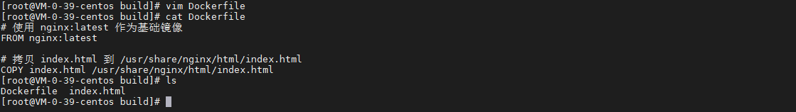

## 前言

从之前的文章《[Docker 文件拷贝](cp.md)》，我们修改了 nginx index.html 的内容，但我们不希望在每个环境都拷贝一次，这时候可以考虑构建一个 docker 镜像，今天我们就来动手学一下构建 docker 镜像。

## 准备工作

### 准备 index.html

``` bash
cat index.html
```


### 准备 Dockerfile

``` bash
# 准备 Dockerfile
vim Dockerfile

# 查看 Dockerfile 内容
cat Dockerfile

# 查看目录结构
ls
```



Dockerfile 内容如下：

``` dockerfile
# 使用 nginx:latest 作为基础镜像
FROM nginx:latest

# 拷贝 index.html 到 /usr/share/nginx/html/index.html
COPY index.html /usr/share/nginx/html/index.html
```

## 构建镜像

使用以下指令构建镜像：

``` bash
docker build -t nginx:erikxu -f Dockerfile ./
```


指令解析：

| 项目 | 说明 |
| ------- | ------- |
| docker build | 构建 docker 镜像 |
| \-t nginx:erikxu | 设置镜像名称，格式为：\-t {镜像名称}:{镜像 tag} |
| \-f Dockerfile | 指定 Dockerfile，格式为 \-f {Dockerfile 路径} |
| ./ | 指定构建目录，./ 表示当前目录，可根据需要调整 |

***注意：切勿把 Dockerfile 打入镜像当中，否则会有安全风险***

## 启动容器

使用以下指令启动容器：

``` bash
docker run --name erikxu-nginx -d -p 80:80 nginx:erikxu
```


index.html 页面内容如下：


## 总结

按照上述的操作，今天应该能成功完成镜像构建的相关操作。

如有问题可以添加公众号【跬步之巅】进行交流。


