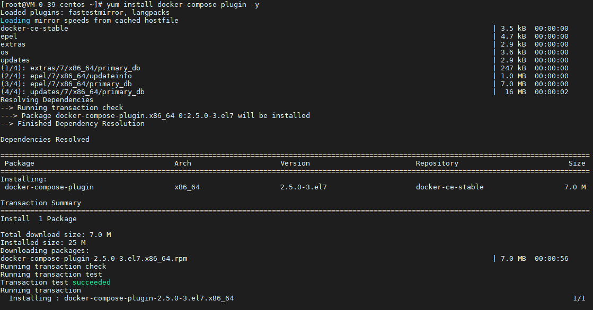
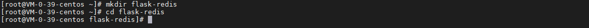

## 前言

Docker Compose 是一个定义和运行多个容器的工具，Docker Compose 通过 YAML 文件来配置应用程序服务，然后使用单个命令创建并启动所有服务，今天我们就来动手学一下 Docker Compose 的文件拷贝。

## 安装

之前安装 docker 的时候默认没有安装 Docker Compose，可通过以下指令安装：

``` bash
yum install docker-compose-plugin -y
```



## 准备

我们将使用 python flask 编写一个 web api，并调用 redis。

### 准备工作目录

使用以下指令准备工作目录：

``` bash
mkdir flask-redis
cd flask-redis
```



### 准备 Flask 代码

使用以下指令新建 app.py 文件：

``` bash
# 新建 app.py 文件
cat <<EOF > app.py
import time

import redis
from flask import Flask

app = Flask(__name__)
cache = redis.Redis(host='redis', port=6379)

def get_hit_count():
    retries = 5
    while True:
        try:
            return cache.incr('hits')
        except redis.exceptions.ConnectionError as exc:
            if retries == 0:
                raise exc
            retries -= 1
            time.sleep(0.5)

@app.route('/')
def hello():
    count = get_hit_count()
    return 'Hello World! I have been seen {} times.\n'.format(count)
EOF

# 检查 app.py 文件
cat app.py
```


使用以下指令新建 requirements.txt 文件：

``` bash
cat <<EOF > requirements.txt
flask
redis
EOF

# 检查 requirements.txt 文件
cat requirements.txt
```


### 准备 Dockerfile

使用以下指令新建 Dockerfile 文件：

``` bash
# 新建 Dockerfile 文件
cat <<EOF > Dockerfile
FROM python:3.7-alpine
WORKDIR /code
ENV FLASK_APP=app.py
ENV FLASK_RUN_HOST=0.0.0.0
RUN sed -i 's/dl-cdn.alpinelinux.org/mirrors.aliyun.com/g' /etc/apk/repositories
RUN apk update
RUN apk add --no-cache gcc musl-dev linux-headers
COPY requirements.txt requirements.txt
RUN pip install -r requirements.txt
EXPOSE 5000
COPY . .
CMD ["flask", "run"]
EOF

# 检查 Dockerfile 文件
cat Dockerfile
```


### 准备 Compose 文件

使用以下指令新建 docker-compose.yml 文件：

``` bash
# 新建 docker-compose.yml 文件
cat <<EOF > docker-compose.yml
version: "3.9"
services:
  web:
    build: .
    ports:
      - "5000:5000"
  redis:
    image: "redis:alpine"
EOF

# 检查 docker-compose.yml 文件
cat docker-compose.yml
```


准备工作完成后，目录文件如下：


## 使用

### 构建镜像

使用以下指令构建镜像：

``` bash
# 构建镜像
docker compose build

# 查看镜像
docker images
```


### 运行程序

使用以下指令构建运行程序：

``` bash
# -d 表示后台运行
docker compose up -d

# 查看运行情况
docker ps
```


浏览器查看运行情况：


### 卸载程序

使用以下指令构建卸载程序：

``` bash
# 卸载
docker compose down

# 查看卸载情况
docker ps -a
```


## 总结

按照上述的操作，今天应该能成功完成 Docker Compose 的相关操作。

如有问题可以添加公众号【跬步之巅】进行交流。


