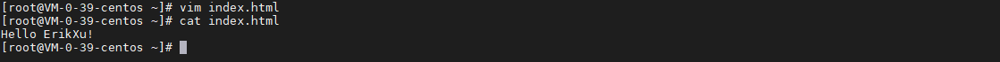
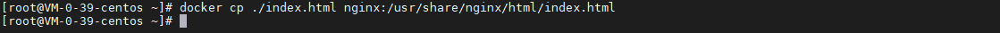

## 前言

有的时候我们需要拷贝文件/目录到 docker 容器或者从 docker 容器拷贝文件/目录出来，今天我们就来动手学一下 docker 的文件拷贝。

## 启动容器

我们还是使用 nginx 这个容器：

``` bash
docker run --name nginx -d -p 80:80 nginx:latest
```


## 从容器中拷贝文件

从之前的文章《[进入 Docker 容器](exec.md)》，我们知道 nginx 的 index.html 的路径为：

/usr/share/nginx/html/index.html

先把这个文件拷贝到宿主机：

``` bash
# 拷贝文件到宿主机
docker cp nginx:/usr/share/nginx/html/index.html ./

# 检查文件内容
cat index.html
```


指令解析：

| 项目 | 说明 |
| ------- | ------- |
| docker cp | 容器拷贝指令 |
| nginx:/usr/share/nginx/html/index.html | 容器目录，格式为 {容器名/容器 Id}:{容器中的文件(夹)路径} |
| ./ | 宿主机目录，./ 表示当前目录 |

index.html 页面内容如下：


## 拷贝文件到容器

修改拷贝出来的 index.html 文件：

``` bash
# 修改文件内容
vim index.html

# 查看修改效果
cat index.html
```



拷贝文件到容器：

``` bash
docker cp ./index.html nginx:/usr/share/nginx/html/index.html
```



指令解析：

| 项目 | 说明 |
| ------- | ------- |
| docker cp | 容器拷贝指令 |
| ./index.html | 宿主机目录，./index.html 表示当前目录的 index.html 文件 |
| nginx:/usr/share/nginx/html/index.html | 容器目录，格式为 {容器名/容器 Id}:{容器中的文件(夹)路径} |

新的 index.html 页面内容如下：


## 总结

按照上述的操作，今天应该能成功完成 docker 文件拷贝的相关操作。

如有问题可以添加公众号【跬步之巅】进行交流。


