## 前言

开发过程中，有时需要获取服务器的硬件信息，在宿主机上获取可能是件简单的事情，如果是在容器里呢？今天我们就来动手学一下在 docker 容器中获取宿主机的硬件信息。

## 启动容器

使用以下指令启动容器：

``` bash
docker run --name nginx -d --privileged=true nginx:latest
```

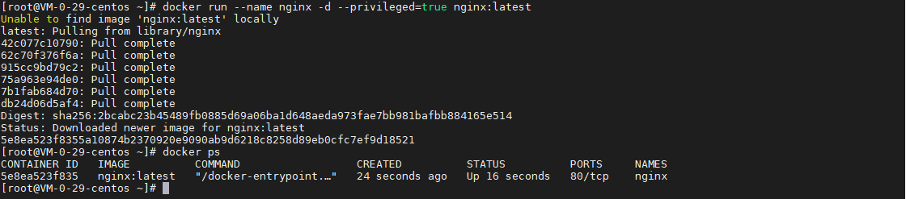

其中 `--privileged=true` 表示启用特权模式，因为获取宿主机的硬件信息时需要较大的权限。

## 获取硬件信息

使用以下指令进入容器：

``` bash
docker exec -it nginx bash
```

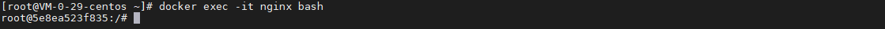

### 获取内存信息

``` bash
# 设置阿里源
sed -i 's|https\?://[^/]\+/|http://mirrors.aliyun.com/|' /etc/apt/sources.list
apt-get update -y

# 安装 lshw
apt-get install lshw -y

# 获取内存型号
lshw -short -C memory

# 获取内存总大小
cat /proc/meminfo | grep 'MemTotal' | awk -F':' '{print $2}'

# 获取可用内存大小
cat /proc/meminfo | grep 'MemFree' | awk -F':' '{print $2}'
```

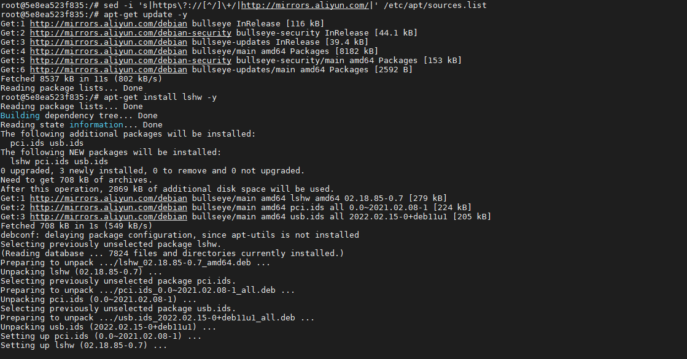

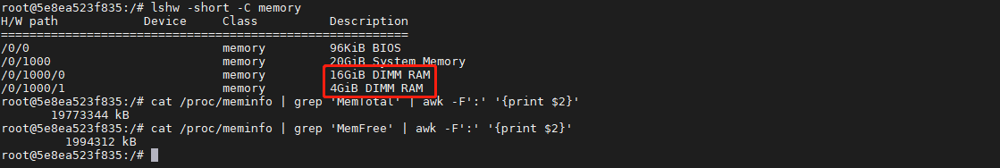

其中，示例服务器的内存是 20 GiB。

### 获取 CPU 信息

``` bash
# 安装 dmidecode
apt-get install dmidecode -y

# 获取 CPU 型号
cat /proc/cpuinfo | grep 'model name' | awk -F':' '{print $2}'

# 获取 CPU 型号方法二，虚拟机环境时信息可能异常
# dmidecode --type processor | grep 'Version' | awk -F':' '{print $2}'

# 获取 CPU ID
dmidecode -t Processor | grep ID | sort -u | awk -F':' '{print $2}'

# 获取 CPU 核数
dmidecode --type processor | grep 'Core Count' | awk -F':' '{print $2}'

# 获取 CPU 线程数
dmidecode --type processor | grep 'Thread Count' | awk -F':' '{print $2}'
```

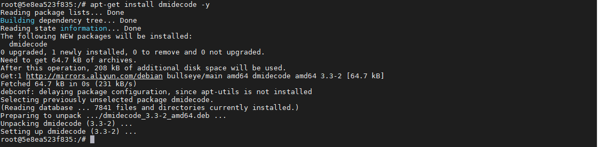

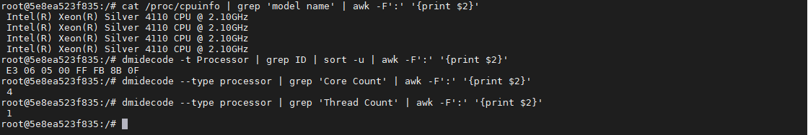

其中，示例服务器的 CPU 是 4 核，型号为 `Intel(R) Xeon(R) Silver 4110 CPU @ 2.10GHz`。

### 获取 MAC 地址

``` bash
# 获取网卡
# 如果存在 eth 网卡，则从 eth 网卡中取 MAC 地址
ls /sys/class/net/ | grep ^eth | sort -un

# 如果存在 enp 或 ens 网卡，则从 enp 或 ens 网卡中取 MAC 地址 
ls /sys/class/net/ | grep ^en | sort -un

# 模板：cat /sys/class/net/{net-name}/address
# 例如网卡为 eth0，则执行
cat /sys/class/net/eth0/address
```

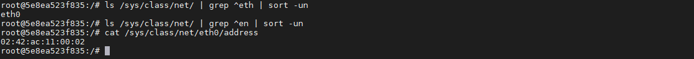

注意：容器里获取的 MAC 地址与宿主机的 MAC 地址不一样的，示例中容器的 MAC 地址是 `02:42:ac:11:00:02`，而宿主机的MAC 地址是 `52:54:00:1b:be:47`：

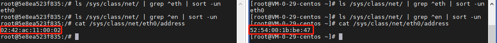

### 获取显卡信息

``` bash
# 安装 lspci
apt-get install pciutils -y

# 获取显卡信息
lspci | grep -i vga
```

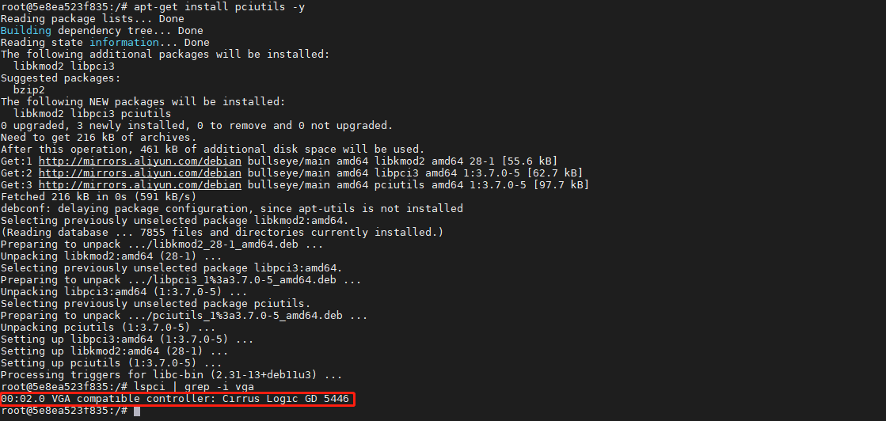

### 获取英伟达显卡信息

获取英伟达显卡型号或者信息会相对复杂一点。

在宿主机上安装 nvidia-docker2：

``` bash
distribution=$(. /etc/os-release;echo $ID$VERSION_ID) \
   && curl -s -L https://nvidia.github.io/libnvidia-container/$distribution/libnvidia-container.repo | sudo tee /etc/yum.repos.d/nvidia-container-toolkit.repo

yum install nvidia-docker2 -y
```

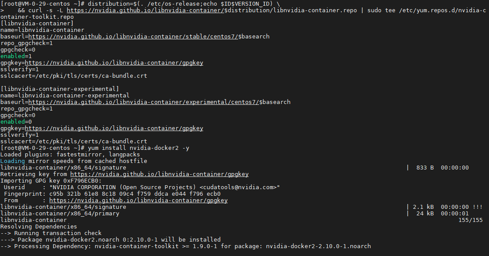

重新启动容器：

``` bash
# 重启 docker
systemctl restart docker

# 删除之前启动的容器
docker rm -f nginx

# 特权模式，并把 nvidia-smi 挂载到容器，分配所有可用 GPU
docker run --name nginx -d --privileged=true -v /usr/bin/nvidia-smi:/usr/bin/nvidia-smi --gpus all nginx:latest
```

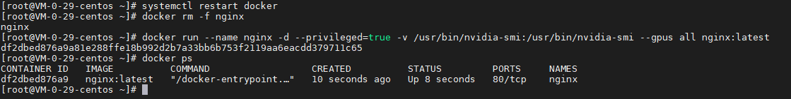

获取英伟达显卡信息：

``` bash
# 进入容器
docker exec -it nginx bash

# 获取英伟达显卡型号
nvidia-smi --query-gpu=name --format=csv,noheader

# 获取英伟达显卡信息
nvidia-smi
```

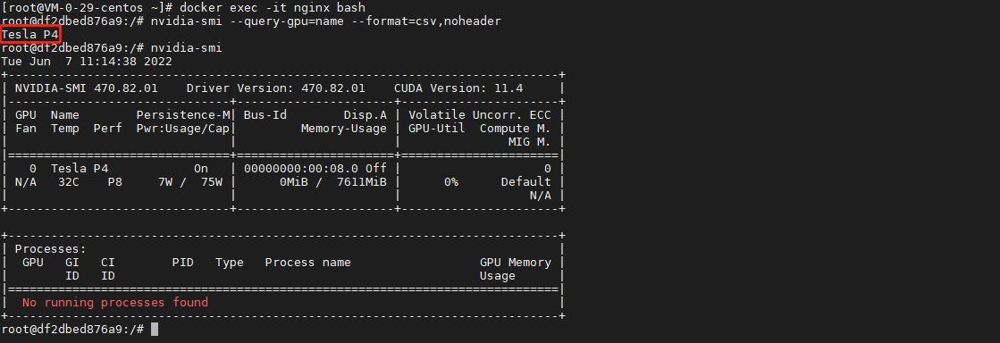

### 获取主板信息

``` bash
dmidecode --type baseboard | grep 'Serial Number' | awk -F':' '{print $2}'
```

由于某些虚拟机的设置不允许获取主板信息，所以该指令可能获取不到主板信息，我在另一台服务器上执行后的输出结果为 `.GXY0Z03.CNFCP009BB00R8.`。

## 总结

按照上述的操作，今天应该能成功完成 Docker 获取硬件信息的相关操作。

如有问题可以添加公众号【跬步之巅】进行交流。


