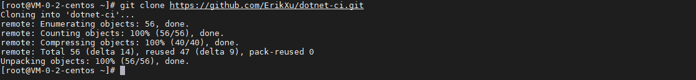
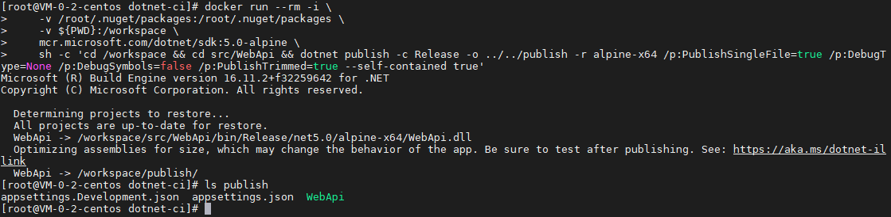
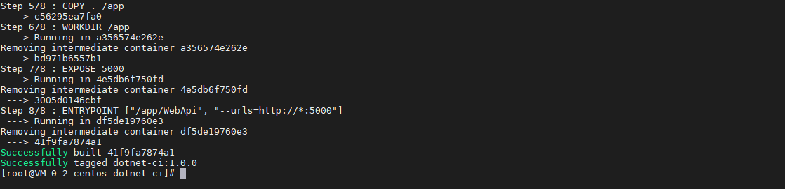
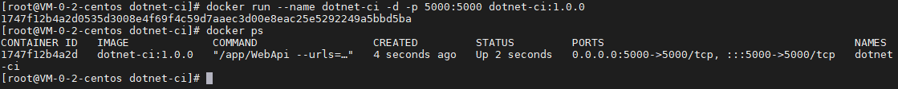
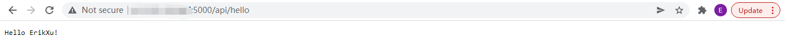

## 前言

从之前的文章《[构建 Docker 镜像](build.md)》，我们简单构建了第一个自己的 docker 镜像，今天我们就来动手学一下构建 .Net 开发程序的 docker 镜像。

## 准备工作

为了方便操作，我用 .Net 5 写好了一个 hello world 的程序，仓库地址是：

[https://github.com/ErikXu/dotnet-ci](https://github.com/ErikXu/dotnet-ci)

安装 git 并克隆代码：

``` bash
yum install git -y

git clone https://github.com/ErikXu/dotnet-ci.git
```



## 镜像构建

进入代码目录：

``` bash
cd dotnet-ci
```

### 编译可执行文件

使用以下指令编译可执行文件：

``` bash
# 编译可执行文件
docker run --rm -i \
    -v /root/.nuget/packages:/root/.nuget/packages \
    -v ${PWD}:/workspace \
    mcr.microsoft.com/dotnet/sdk:5.0-alpine \
    sh -c 'cd /workspace && cd src/WebApi && dotnet publish -c Release -o ../../publish -r alpine-x64 /p:PublishSingleFile=true /p:DebugType=None /p:DebugSymbols=false /p:PublishTrimmed=true --self-contained true'

# 查看可执行文件
ls publish
```



指令解析：

| 项目 | 说明 |
| ------- | ------- |
| docker run | 启动 docker 容器 |
| \-\-rm | 退出容器时销毁容器 |
| -i | 容器交互模式 |
| -v /root/.nuget/packages:/root/.nuget/packages | 把宿主机的 /root/.nuget/packages 目录映射到容器目录 /root/.nuget/packages，重用已下载过的包 |
| -v ${PWD}:/workspace | 把宿主机当前目录映射到容器目录 /workspace |
| mcr.microsoft.com/dotnet/sdk:5.0-alpine | 使用 .Net 5 SDK 镜像，Alpine 操作系统 |
| sh -c cd /workspace && ... | 启动指令，进入 /workspace 目录执行 dotnet build 编译可执行文件 |

dotnet build 指令解析：

| 项目 | 说明 |
| ------- | ------- |
| -c Release | 以 Release 模式编译可执行文件 |
| -o ../../publish | 可执行文件输出到 ../../publish 目录 |
| -r alpine-x64 | 指定运行平台为 alpine-x64 |
| /p:PublishSingleFile=true | 打包成单文件 |
| /p:DebugType=None | Debug 类型为 None |
| /p:DebugSymbols=false | 不生成 Debug Symbols |
| /p:PublishTrimmed=true | 设置文件压缩，排除不需要的包，可执行文件大小大概为 30M |
| \-\-self-contained true | 设置可执行文件中包含 .Net 5 runtime |

### 构建镜像

使用以下指令把可执行文件打入镜像：

``` bash
docker build --no-cache --disable-content-trust=true -t dotnet-ci:1.0.0 -f ./docker/Dockerfile ./publish/
```




指令解析：

| 项目 | 说明 |
| ------- | ------- |
| docker build | 构建 docker 容器 |
| -t dotnet-ci:1.0.0 | 设置镜像名称为 dotnet-ci:1.0.0 |
| \-\-no-cache | 不使用镜像缓存 |
| \-\-disable-content-trust=true | 禁用内容信任 |
| -f ./docker/Dockerfile | 设置 Dockerfile 的路径为 ./docker/Dockerfile |
| ./publish/ | 指定构建目录为 ./publish/ |

其中 Dockerfile 内容如下：

``` dockerfile
# 使用 alpine 作为基础镜像
FROM alpine:3.14

# 操作系统使用阿里云的源
RUN sed -i 's/dl-cdn.alpinelinux.org/mirrors.aliyun.com/g' /etc/apk/repositories

# 安装运行 .Net 程序相关依赖
RUN apk update
RUN apk add --no-cache \
        ca-certificates \
        krb5-libs \
        libgcc \
        libintl \
        libssl1.1 \
        libstdc++ \
        zlib

# 拷贝可执行文件到 /app
COPY . /app

# 设置 /app 为工作目录
WORKDIR /app

# 暴露 5000 端口
EXPOSE 5000

# 启动指令
ENTRYPOINT ["/app/WebApi", "--urls=http://*:5000"]
```

## 镜像运行

使用以下指令运行镜像：

``` bash
# 运行镜像
docker run --name dotnet-ci -d -p 5000:5000 dotnet-ci:1.0.0

# 查看运行情况
docker ps
```



运行效果：



## 总结

按照上述的操作，今天应该能成功完成 .Net 镜像构建的相关操作。

如有问题可以添加公众号【跬步之巅】进行交流。


