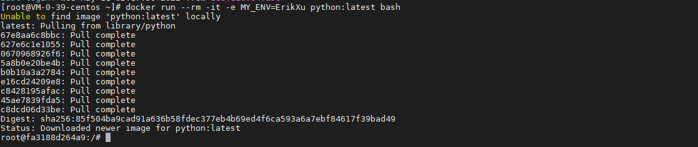
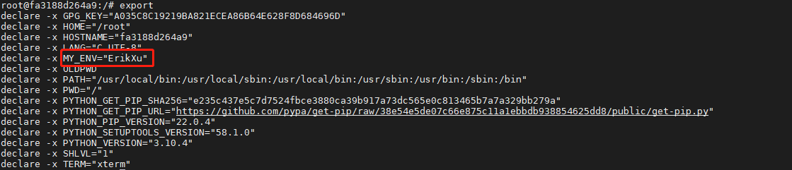
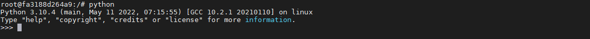
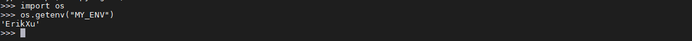
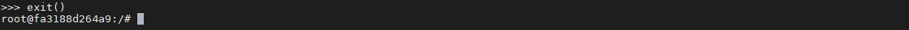
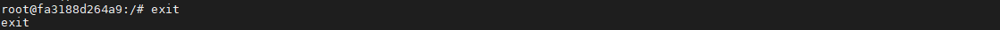

## 前言

今天将介绍 docker 的环境变量，环境变量相当于 Windows 里的系统变量。环境变量可以理解为独立于 docker 镜像的配置，程序可以通过读取环境变量来处理不同的逻辑。今天我们就来动手学一下 docker 环境变量。

## 启动容器

使用以下指令启动容器：

``` bash
docker run --rm -it -e MY_ENV=ErikXu python:latest bash
```



指令解析：

| 项目 | 说明 |
| ------- | ------- |
| docker run | 启动 docker 容器 |
| \-\-rm | 退出容器时销毁容器 |
| \-it | 容器交互模式 |
| \-e MY_ENV=ErikXu | 设置环境变量 MY_ENV 的值为 ErikXu |
| python:latest | 使用 python 的最新镜像 |
| bash | 使用 bash 作为镜像启动指令 |

## 查看环境变量

使用以下指令查看环境变量：

``` bash
export
```



## 通过代码环境变量

进入 python 交互窗口：

``` bash
python
```



通过 python 代码获取环境变量：

``` python
import os
os.getenv("MY_ENV")
```



输入 exit() 退出 python 交互：

``` bash
exit()
```



输入 exit 退出并销毁 docker 容器：

``` bash
exit
```



## 总结

按照上述的操作，今天应该能成功完成环境变量的相关操作。

如有问题可以添加公众号【跬步之巅】进行交流。


