## 前言

启动了第一个 docker 程序后，今天我们就来动手进入下该容器。

## 进入容器

### 使用指令进入容器

使用以下指令进入 nginx 容器：

``` bash
docker exec -it nginx bash
```

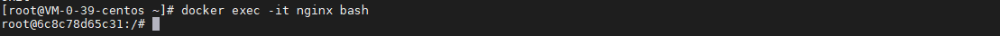

### 查看容器的操作系统

使用以下指令查看容器的操作系统：

``` bash
cat /etc/os-release
```

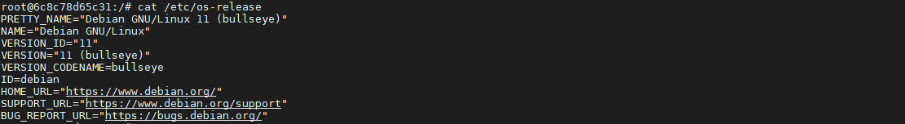

从结果来看，nginx 使用的是 debian 的操作系统，和 ubuntu 同源。

### 查看容器的启动进程

使用以下指令查看容器的启动进程：

``` bash
ps -ef
```

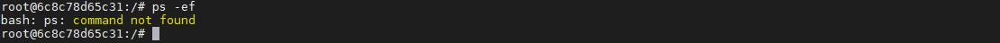

可以发现，容器没装 ps，我们安装一下：

``` bash
apt-get update -y && apt-get install procps -y
```

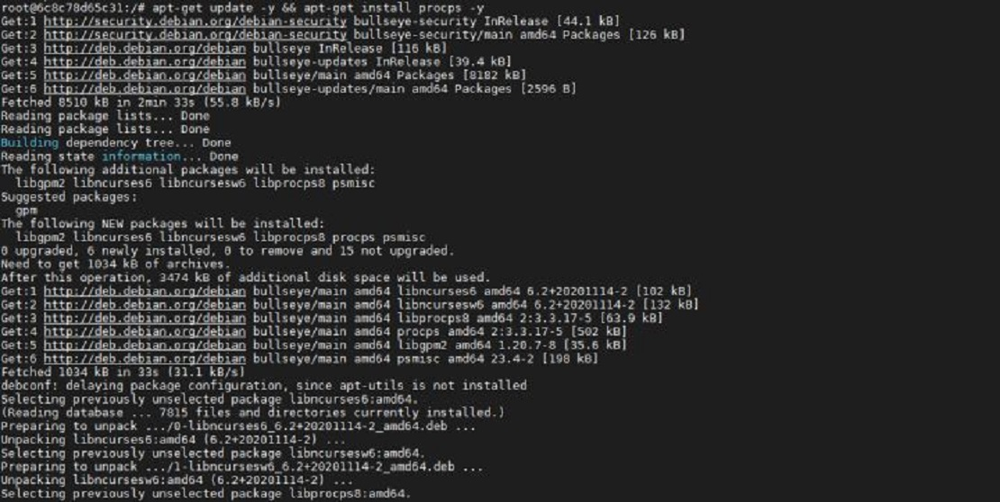

安装完成后，再重新查看启动进程：

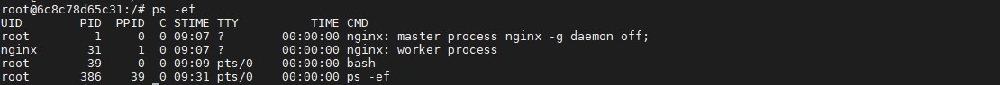

PID 为 1 的进程是 docker 容器中非常重要的一个进程，如果这个进程退出了，容器就会退出：

``` bash
# 杀掉 PID 为 1 的进程
kill 1

# 查看容器退出 
docker ps -a
```

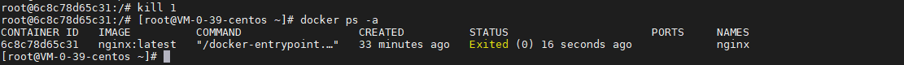

### 修改容器内容

重新启动并进入容器：

``` bash
# 重启容器
docker start nginx

# 进入容器
docker exec -it nginx bash
```

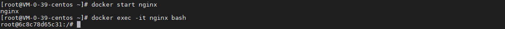

查询 nginx 的 index.html 的路径：

``` bash
find / -name index.html
```

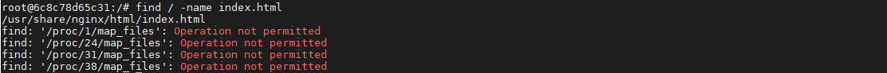

修改 index.html 的内容：

``` bash
vim /usr/share/nginx/html/index.html
```

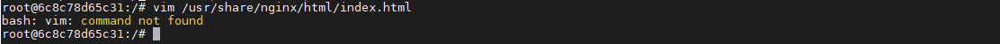

没有安装 vim，安装一下：

``` bash
apt-get install vim -y
```

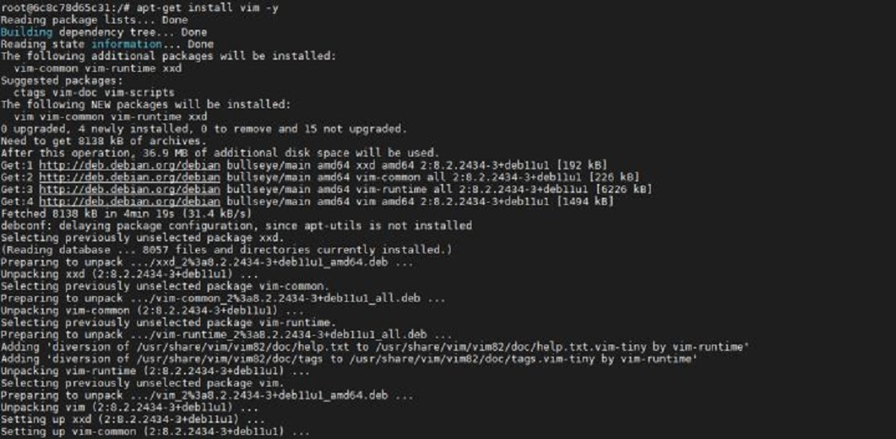

继续修改 index.html 的内容：

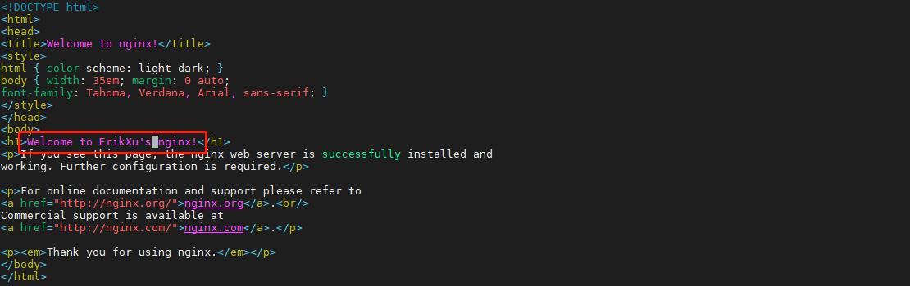

查看修改效果：

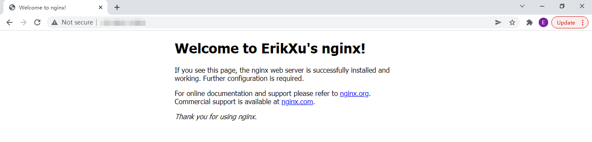

## 总结

按照上述的操作，今天应该成功完成进入运行的 docker 容器相关操作。

如有问题可以添加公众号【跬步之巅】进行交流。


