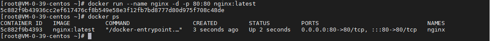
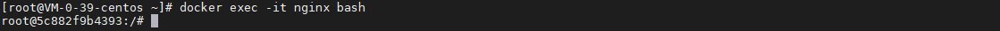
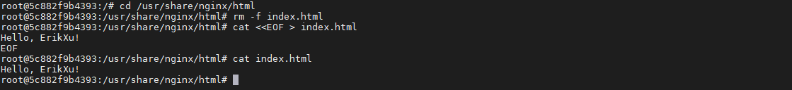
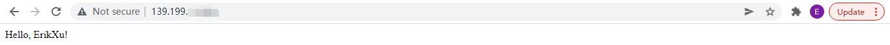
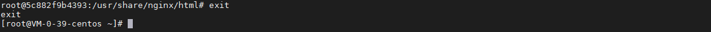
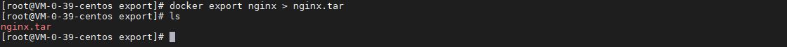
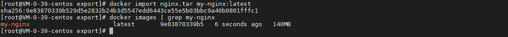
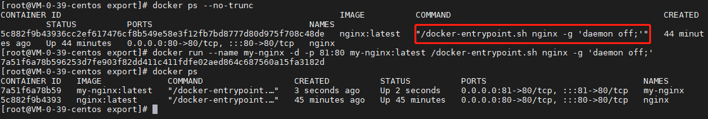
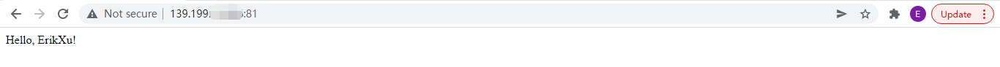
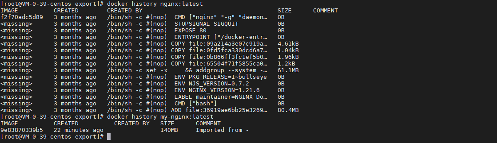

## 前言

docker save 可以把 docker 镜像保存到本地，docker commit 可以把容器保存为镜像，docker export 可以把 docker 容器保存到本地，今天我们就来动手学一下 docker 容器导入导出。

## 启动容器

我们还是使用 nginx 这个容器：

``` bash
docker run --name nginx -d -p 80:80 nginx:latest
```



## 修改容器

### 进入容器

使用以下指令进入容器：

``` bash
docker exec -it nginx bash
```



### 修改容器内容

使用以下修改容器内容：

``` bash
# 进入 index.html 目录
cd /usr/share/nginx/html

# 删除 index.html
rm -f index.html

# 使用指定内容新建 index.html
cat <<EOF > index.html
Hello, ErikXu!
EOF

# 查看 index.html 内容
cat index.html
```



### 查看修改效果

浏览器查看修改效果：



### 退出容器

使用以下指令退出容器：

``` bash
exit
```



## 导出镜像

使用以下指令导出镜像文件：

``` bash
# 导出镜像文件
docker export nginx > nginx.tar

# 查看导出镜像文件
ls
```



## 导入镜像

使用以下指令导入镜像：

``` bash
# 导入镜像
docker import nginx.tar my-nginx:latest

# 查看导入镜像
docker images | grep my-nginx
```



## 启动新容器

使用以下指令基于新镜像启动容器：

``` bash
# 查找原 nginx 的启动指令
docker ps --no-trunc

# 启动新容器
docker run --name my-nginx -d -p 81:80 my-nginx:latest /docker-entrypoint.sh nginx -g 'daemon off;'

# 查看启动新容器
docker ps
```



浏览器查看效果：



## 补充说明

通过 docker export 导出的镜像会丢失所有的历史和层（lay），这一般应用于需要保护镜像历史信息的场景：

``` bash
# 查看原镜像的历史
docker history nginx:latest

# 查看新镜像的历史
docker history my-nginx:latest
```



## 总结

按照上述的操作，今天应该能成功完成容器导入导出的相关操作。

如有问题可以添加公众号【跬步之巅】进行交流。


