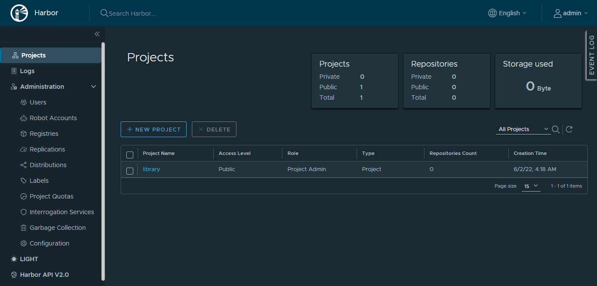

## 前言

Harbor 是目前比较常用的私有镜像仓库中间件，今天我们就来动手学一下用 Docker Compose 安装 Harbor。

## 准备工作

### 下载 Harbor

可以到 <https://github.com/goharbor/harbor/releases> 查询并下载指定版本的 harbor 的安装包。

这里使用 v2.5.1 版本，使用以下指令下载安装包：

``` bash
wget https://github.com/goharbor/harbor/releases/download/v2.5.1/harbor-offline-installer-v2.5.1.tgz
```


### 解压 Harbor

使用以下指令解压安装包：

``` bash
# 解压
tar zxvf harbor-offline-installer-v2.5.1.tgz

# 查看解压内容
cd harbor
ls
```


### 准备配置文件

使用以下指令解压创建 harbor.yml：

``` bash
# 修改默认域名 reg.mydomain.com 为指定域名 harbor.erikxu.com（可根据需要调整）
cat harbor.yml.tmpl | sed 's/reg.mydomain.com/harbor.erikxu.com/g' > harbor.yml

# 为了简化过程，我们仅使用 http
vim harbor.yml

#注释掉以下内容
#https:
  # https port for harbor, default is 443
#  port: 443
  # The path of cert and key files for nginx
#  certificate: /your/certificate/path
#  private_key: /your/private/key/path
```


## 安装

之前通过 `yum install docker-compose-plugin -y` 安装的是 Docker Compose V2 的版本，但是 Harbor 使用的是Docker Compose V1 的版本，使用以下指令安装Docker Compose V1 的版本：

``` bash
yum install -y docker-compose
```


对比下两个 Docker Compose 的版本：

``` bash
# V2
docker compose version

# V1
docker-compose -v
```


使用以下指令安装 Harbor：

``` bash
./install.sh
```


查看 Harbor 安装情况：

``` bash
docker ps
```


## 使用

### 访问管理控制台

浏览器访问管理控制台，默认账号密码为 admin / Harbor12345:



可以看出默认已经有一个 library 的项目。

### 修改 daemon.json

新增/修改 daemon.json 使 docker 支持使用 http 和 Harbor 交互：

``` bash
# 10.0.0.2 是 Harbor 安装机器的子网 IP，请根据真实情况调整
cat <<EOF > /etc/docker/daemon.json
{
"insecure-registries" : ["10.0.0.2", "0.0.0.0"]
}
EOF

# 检查 daemon.json 文件
cat /etc/docker/daemon.json

# 重启 docker 
systemctl restart docker
```


### Docker 登录 Harbor

使用以下指令登录 Harbor，默认账号密码为 admin / Harbor12345:

``` bash
# 在本地 hosts 添加 DNS 解析
# 10.0.0.2 是 Harbor 安装机器的子网 IP，请根据真实情况调整
echo '10.0.0.2 harbor.erikxu.com' >> /etc/hosts
cat /etc/hosts

# 10.0.0.2 是 Harbor 安装机器的子网 IP，请根据真实情况调整
docker login 10.0.0.2
```


其中登录信息是以 Base64 格式存放在 `~/.docker/config.json` 文件中：

``` bash
# 查看登录信息
cat ~/.docker/config.json

# 解压 Base64 
echo "{BASE64_STRING}" | base64 -d
```


### 上传镜像到 Harbor

使用以下指令上传镜像到 Harbor：

``` bash
# 从 docker hub 拉取 busybox 镜像
docker pull busybox
docker images | grep busybox

# 基于 busybox 重命名一个镜像 10.0.0.2/library/busybox，其中
# 10.0.0.2 是 Harbor 安装机器的子网 IP，请根据真实情况调整
# library 为镜像存放项目
docker tag busybox 10.0.0.2/library/busybox
docker images | grep busybox

# 上传镜像
docker push 10.0.0.2/library/busybox
```


在管理控制台查看上传的镜像：


### 从 Harbor 下载镜像

使用以下指令拉取镜像：

``` bash
# 先删除已有镜像
docker rmi busybox
docker rmi 10.0.0.2/library/busybox
docker images | grep busybox

# 拉取镜像
docker pull 10.0.0.2/library/busybox
docker images | grep busybox
```


## 卸载

使用以下指令卸载 Harbor：

``` bash
# 在 Harbor 解压目录中执行
docker-compose down -v

# 查看卸载情况
docker ps -a
```


## 总结

按照上述的操作，今天应该能成功完成安装 Harbor 的相关操作。

如有问题可以添加公众号【跬步之巅】进行交流。


