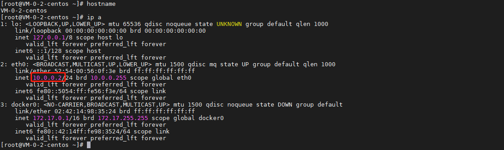
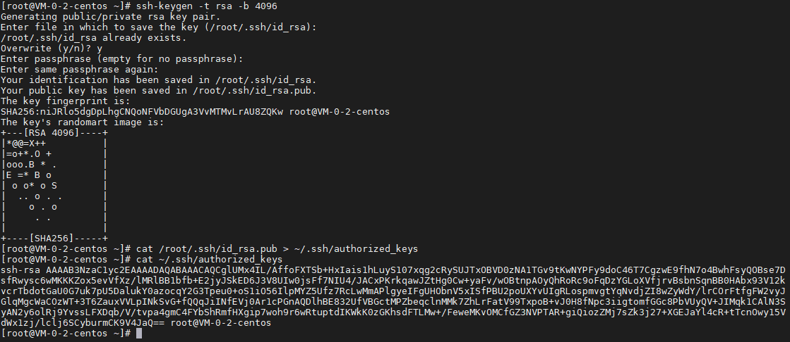
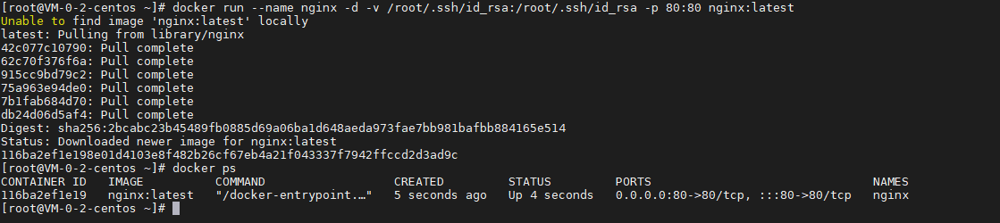
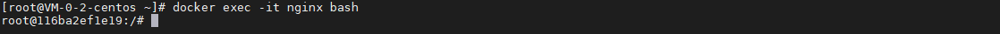
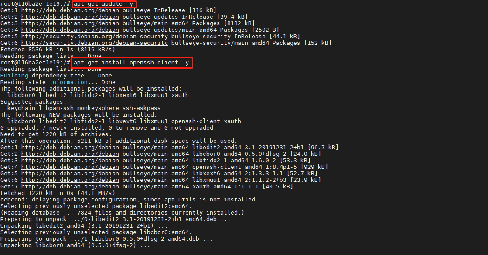
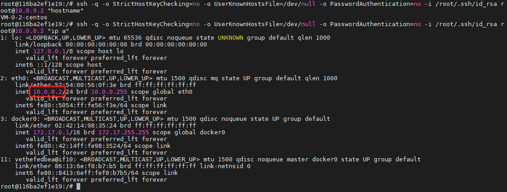
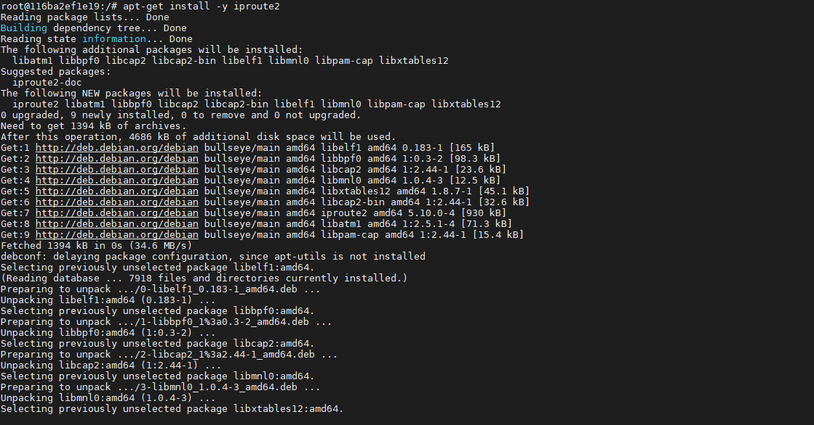
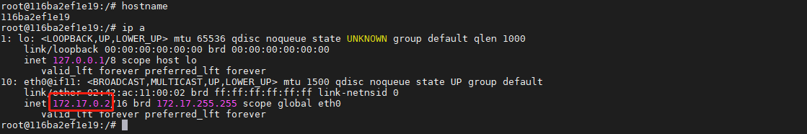

## 前言

在 docker 中想最大限度地操作宿主机，一般需要使用 ssh 的方式，今天我们就来动手学一下在 docker 容器访问宿主机。

## 准备工作

### 获取宿主机信息

通过以下指令获取宿主机名称和 IP：

``` bash
# 获取主机名
hostname

# 获取 IP
ip a
```



### 配置 SSH Key

通过以下指令配置 SSH Key：

``` bash
# 生成 key
ssh-keygen -t rsa -b 4096

# 把 public key 加入到 authorized_keys
cat /root/.ssh/id_rsa.pub > ~/.ssh/authorized_keys

# 检查 public key 是否写入 authorized_keys
cat ~/.ssh/authorized_keys
```



## 启动容器

我们还是使用 nginx 这个容器，同时把 private key 挂载到容器中：

``` bash
docker run --name nginx -d -v /root/.ssh/id_rsa:/root/.ssh/id_rsa -p 80:80 nginx:latest
```



## 访问宿主机

### 进入容器

使用以下指令进入容器：

``` bash
docker exec -it nginx bash
```



### 安装 SSH 客户端

使用以下指令安装 SSH 客户端：

``` bash
# 更新源
apt-get update -y

# 安装 ssh client
apt-get install openssh-client -y
```



### 操作宿主机

使用以下指令来操作宿主机：

``` bash
# 模板
# ssh -q -o StrictHostKeyChecking=no -o UserKnownHostsFile=/dev/null -o PasswordAuthentication=no -i /root/.ssh/id_rsa {user}@{nodeIp} "{command}"

# 示例，获取宿主机 hostname
ssh -q -o StrictHostKeyChecking=no -o UserKnownHostsFile=/dev/null -o PasswordAuthentication=no -i /root/.ssh/id_rsa root@10.0.0.2 "hostname"

# 示例，获取宿主机 IP
ssh -q -o StrictHostKeyChecking=no -o UserKnownHostsFile=/dev/null -o PasswordAuthentication=no -i /root/.ssh/id_rsa root@10.0.0.2 "ip a"
```



### 获取容器信息

使用以下指令获取容器信息，并查看容器与宿主机的信息差异：

``` bash
# 安装 iproute2 查看容器 IP
apt-get install -y iproute2

# 获取容器 hostname
hostname

# 获取容器 IP
ip a
```





## 信息对比

| 内容 | 容器 | 宿主机 |
| ------- | ------- |  ------- |
| 主机名 | 116ba2ef1e19 | VM-0-2-centos |
| IP | 172.17.0.2 | 10.0.0.2 |
| MAC 地址 | 02:42:ac:11:00:02 | 52:54:00:56:0f:3e |

## 总结

按照上述的操作，今天应该能成功完成容器访问宿主机的相关操作。

如有问题可以添加公众号【跬步之巅】进行交流。


