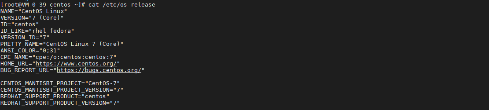
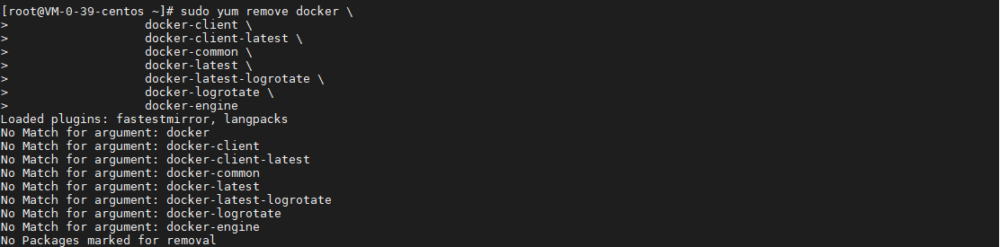
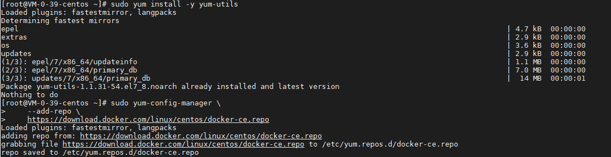
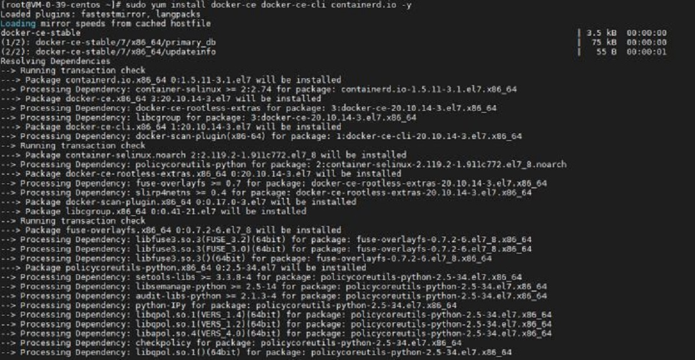
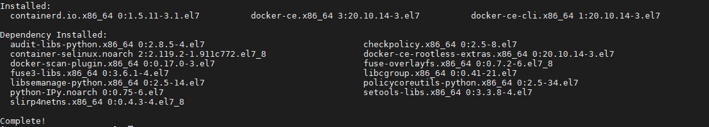
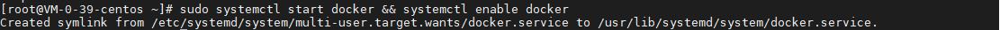
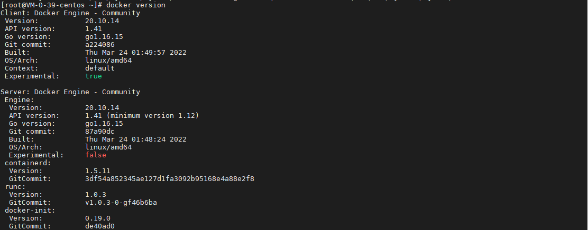

## 前言

要学习 docker，首先要安装 docker，今天我们就来动手学一下 docker 安装。

## 查看操作系统

使用以下指令查看操作系统：

``` bash
cat /etc/os-release
```



## 卸载老版本 Docker

卸载老版本的 docker，如果你之前没有安装过 docker，可以跳过这步。

``` bash
sudo yum remove docker \
                docker-client \
                docker-client-latest \
                docker-common \
                docker-latest \
                docker-latest-logrotate \
                docker-logrotate \
                docker-engine
```



## 设置仓库源 - Repository

使用以下指令设置仓库源：

``` bash
sudo yum install -y yum-utils

sudo yum-config-manager \
    --add-repo \
    https://download.docker.com/linux/centos/docker-ce.repo
```



## 安装 Docker

使用以下指令安装 docker：

``` bash
sudo yum install docker-ce docker-ce-cli containerd.io -y
```



安装需要一到几分钟时间，安装完成后，会如下图所示：



## 启动并设置开机启动 Docker

使用以下指令启动并设置开机启动 docker：

``` bash
sudo systemctl start docker && systemctl enable docker
```



## 查看安装的 Docker 版本

使用以下指令查看 docker 版本：

``` bash
docker version
```



如图所示，当前安装的 docker 版本为 20.10.14。

## 总结

按照上述的操作，今天应该可以完成 docker 的安装。

如有问题可以添加公众号【跬步之巅】进行交流。


