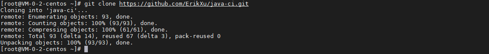
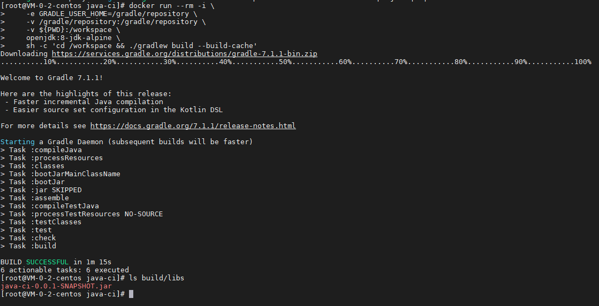
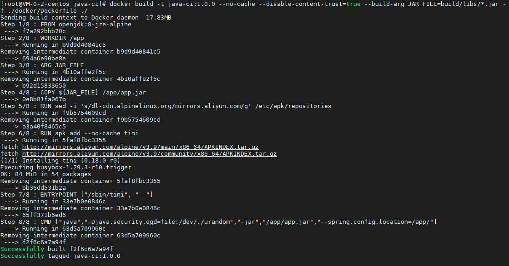
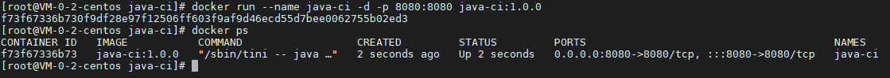
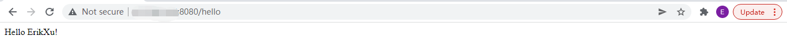

## 前言

从之前的文章《[构建 Docker 镜像](build.md)》，我们简单构建了第一个自己的 docker 镜像，今天我们就来动手学一下构建 java 开发程序的 docker 镜像。

## 准备工作

为了方便操作，我用 spring boot 写好了一个 hello world 的程序，仓库地址是：

[https://github.com/ErikXu/java-ci](https://github.com/ErikXu/java-ci)

安装 git 并克隆代码：

``` bash
yum install git -y

git clone https://github.com/ErikXu/java-ci.git
```



## 镜像构建

进入代码目录：

``` bash
cd java-ci
```

### 编译 jar 包

使用以下指令编译 jar 包：

``` bash
# 编译 jar 包
docker run --rm -i \
    -e GRADLE_USER_HOME=/gradle/repository \
    -v /gradle/repository:/gradle/repository \
    -v ${PWD}:/workspace \
    openjdk:8-jdk-alpine \
    sh -c 'cd /workspace && ./gradlew build --build-cache'

# 查看 jar 包
ls build/libs
```



指令解析：

| 项目 | 说明 |
| ------- | ------- |
| docker run | 启动 docker 容器 |
| \-\-rm | 退出容器时销毁容器 |
| \-i | 容器交互模式 |
| \-e GRADLE_USER_HOME=/gradle/repository | 设置 GRADLE_USER_HOME |
| \-v /gradle/repository:/gradle/repository | 把宿主机的 /gradle/repository 目录映射到容器目录 /gradle/repository，重用已下载过的包 |
| \-v ${PWD}:/workspace | 把宿主机当前目录映射到容器目录 /workspace |
| openjdk:8-jdk-alpine | 使用 java 8 open jdk 镜像 |
| sh \-c 'cd /workspace && ./gradlew build \-\-build-cache' | 启动指令，进入 /workspace 目录并执行 gradlew build |

***注意：第一次运行需要下载 gradle，后续编译不会再下载***

### 构建镜像

使用以下指令把 jar 包打入镜像：

``` bash
docker build -t java-ci:1.0.0 --no-cache --disable-content-trust=true --build-arg JAR_FILE=build/libs/*.jar -f ./docker/Dockerfile ./
```



指令解析：

| 项目 | 说明 |
| ------- | ------- |
| docker build | 构建 docker 容器 |
| -t java-ci:1.0.0 | 设置镜像名称为 java-ci:1.0.0 |
| --no-cache | 不使用镜像缓存 |
| --disable-content-trust=true | 禁用内容信任 |
| --build-arg JAR_FILE=build/libs/*.jar | 设置构建参数 JAR_FILE 的值为 build/libs/*.jar |
| -f ./docker/Dockerfile | 设置 Dockerfile 的路径为 ./docker/Dockerfile |
| ./ | 指定构建目录，./ 表示当前目录 |

其中 Dockerfile 内容如下：

``` dockerfile
# 使用 java 8 jre 作为基础镜像
FROM openjdk:8-jre-alpine

# 设置 /app 为工作目录
WORKDIR /app

# 定义构建参数 JAR_FILE，表示宿主机 jar 包的路径
ARG JAR_FILE

# 把 jar 包拷贝到镜像的 /app/app.jar 位置
COPY ${JAR_FILE} /app/app.jar

# 操作系统使用阿里云的源
RUN sed -i 's/dl-cdn.alpinelinux.org/mirrors.aliyun.com/g' /etc/apk/repositories

# 安装 tini
RUN apk add --no-cache tini

# 使用 tini 模式启动程序
ENTRYPOINT ["/sbin/tini", "--"]
CMD ["java","-Djava.security.egd=file:/dev/./urandom","-jar","/app/app.jar","--spring.config.location=/app/"]
```

## 镜像运行

使用以下指令运行镜像：

``` bash
# 运行镜像
docker run --name java-ci -d -p 8080:8080 java-ci:1.0.0

# 查看运行情况
docker ps
```



运行效果：



## 总结

按照上述的操作，今天应该能成功完成 Java 镜像构建的相关操作。

如有问题可以添加公众号【跬步之巅】进行交流。


