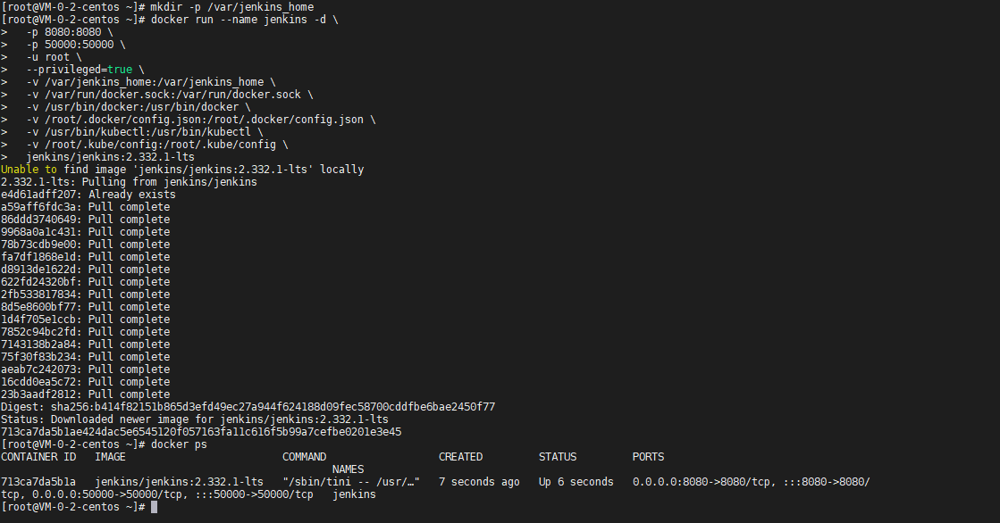
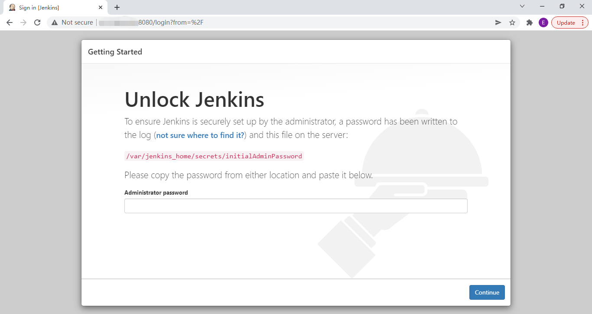
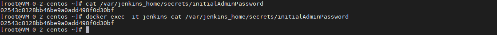
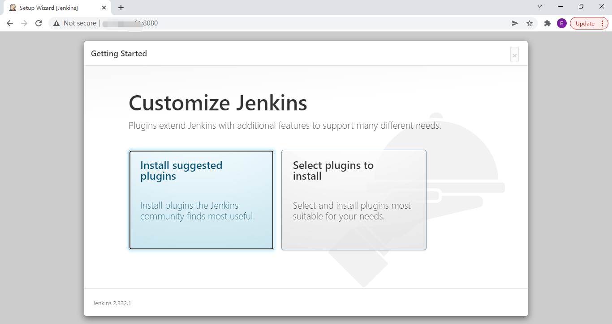
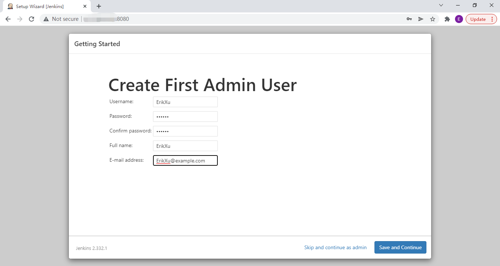
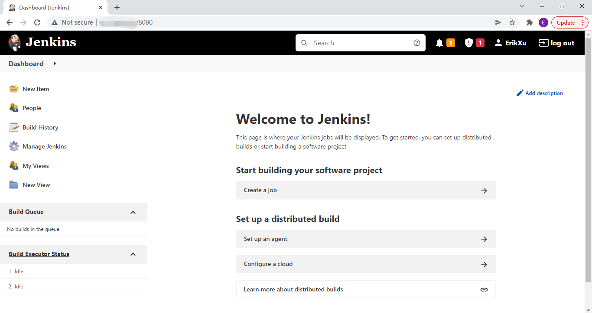

## 前言

Jenkins 是目前比较常用的 CI 中间件，今天我们就来动手学一下用 docker 安装 Jenkins。

## 安装

使用以下指令安装 Jenkins：

``` bash
# 创建数据持久化目录
mkdir -p /var/jenkins_home

docker run --name jenkins -d \
  -p 8080:8080 \
  -p 50000:50000 \
  -u root \
  --privileged=true \
  -v /var/jenkins_home:/var/jenkins_home \
  -v /var/run/docker.sock:/var/run/docker.sock \
  -v /usr/bin/docker:/usr/bin/docker \
  -v /root/.docker/config.json:/root/.docker/config.json \
  -v /usr/bin/kubectl:/usr/bin/kubectl \
  -v /root/.kube/config:/root/.kube/config \
  jenkins/jenkins:2.332.1-lts

# 查看 Jenkins 启动情况
docker ps
```



指令解析：

| 项目 | 说明 |
| ------- | ------- |
| docker run | 启动 docker 容器 |
| \-\-name jenkins | 设置容器名称为 jenkins |
| \-d | 后台运行 |
| \-p 8080:8080 | 把宿主机的 8080 端口映射到容器的 8080 端口，其中 8080 为 Web 界面端口 |
| \-p 50000:50000 | 把宿主机的 50000 端口映射到容器的 50000 端口，其中 50000 为 Agent 端口 |
| \-u root | 使用 root 用户运行容器 |
| \-\-privileged=true | 使用特权模式，主要是为了实现 docker in docker |
| \-v /var/jenkins_home:/var/jenkins_home | 把宿主机的 /var/jenkins_home 目录映射到容器目录 /var/jenkins_home，其中 /var/jenkins_home 为 jenkins 的工作目录 |
| \-v /var/run/docker.sock:/var/run/docker.sock | 把宿主机的 /var/run/docker.sock 目录映射到容器目录 /var/run/docker.sock，docker in docker 需要用到 |
| \-v /usr/bin/docker:/usr/bin/docker | 把宿主机的 /usr/bin/docker 目录映射到容器目录 /usr/bin/docker，docker in docker 需要用到 |
| \-v /root/.docker/config.json:/root/.docker/config.json | 可选，把宿主机的 /root/.docker/config.json 目录映射到容器目录 /root/.docker/config.json，其中 /root/.docker/config.json 保存了宿主机 docker login 的信息，使用 docker in docker 时不需要再登录 |
| \-v /usr/bin/kubectl:/usr/bin/kubectl | 可选，把宿主机的 /usr/bin/kubectl 目录映射到容器目录 /usr/bin/kubectl，共用宿主机的 kubectl 和 kubernetes 通讯 |
| \-v /root/.kube/config:/root/.kube/config | 可选，把宿主机的 /root/.kube/config 目录映射到容器目录 /root/.kube/config，共用宿主机的 kubernetes 证书和 kubernetes 通讯 |
| jenkins/jenkins:2.332.1-lts | 使用镜像，这里是 jenkins 2.332.1 long time support 版本，可以根据需要调整 |

## 使用

### 解锁 Jenkins

第一次浏览器访问 Jenkins 需要解锁：



使用以下指令获取解锁密码：

``` bash
# 访问宿主机挂载目录
cat /var/jenkins_home/secrets/initialAdminPassword

# 访问容器目录
docker exec -it jenkins cat /var/jenkins_home/secrets/initialAdminPassword
```



### 安装推荐插件



### 创建 Admin 用户



### 访问控制台



## 总结

按照上述的操作，今天应该能成功完成 Jenkins 安装的相关操作。

如有问题可以添加公众号【跬步之巅】进行交流。


