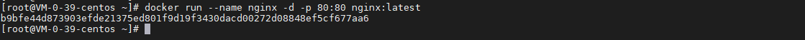
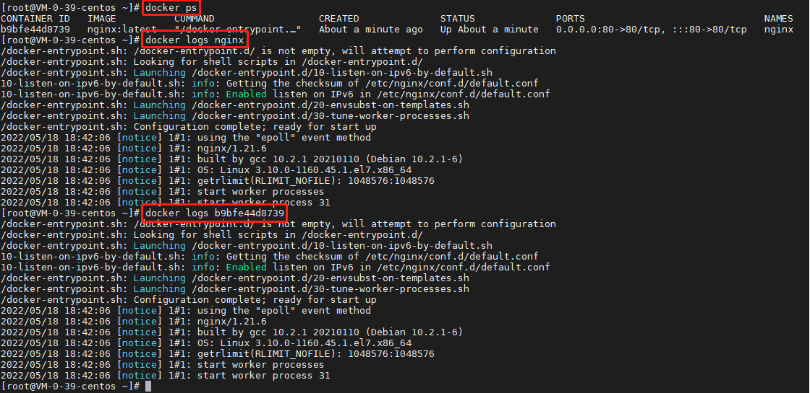
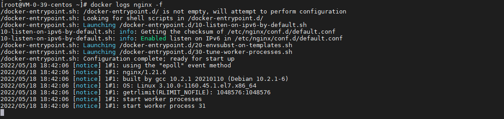
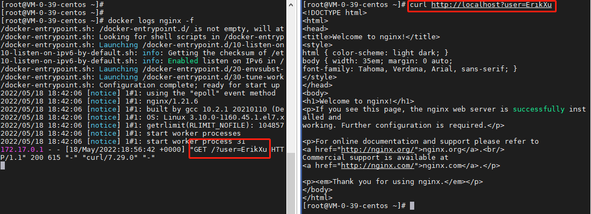
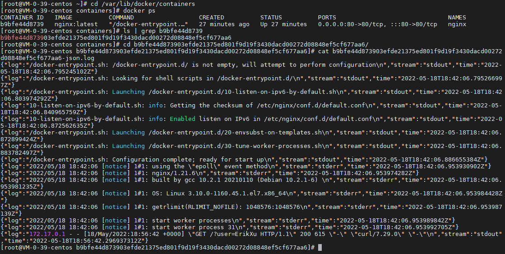

## 前言

日志是跟踪应用程序的主要途径，今天我们就来动手学一下 docker 的日志。

## 启动容器

我们还是使用 nginx 这个容器：

``` bash
docker run --name nginx -d -p 80:80 nginx:latest
```



## 查看日志

### 普通模式

``` bash
# 查看运行中的容器
docker ps

# 通过容器名查看日志
docker logs nginx

# 通过容器 Id 查看日志
docker logs {容器 Id}
```



### 监听模式

``` bash
docker logs nginx -f
```



访问 nginx 观察日志监听效果：

``` bash
curl http://localhost?user=ErikXu
```



### 日志目录

我们先使用 Ctrl+C 退出日志监听模式，然后进入到宿主机的目录 /var/lib/docker/containers，然后查看日志文件内容：

``` bash
# 进入目录
cd /var/lib/docker/containers

# 查看 docker 短容器 Id，找到对应的日志文件
docker ps

# 查找目录文件，一般容器完整 Id
ls | grep {容器 Id}

# 查看日志内容
cd {容器完整 Id}
cat {容器完整 Id}-json.log
```



日志目录是一个很重要的概念，docker 会把标准输出流和标准错误流（stdout/stderr）的内容保存到日志目录，ELK/EFK 的基本原理其实就是 fluentd/fluentBit/fileBeat/logstash 等定期扫描日志目录，然后把日志内容发送到 ElasticSearch，需要注意的是，kubernetes 日志目录是 /var/log/containers，而这目录其实也是 /var/lib/docker/containers 的一个链接而已。

## 总结

按照上述的操作，今天应该能成功完成查看日志的相关操作。

如有问题可以添加公众号【跬步之巅】进行交流。


