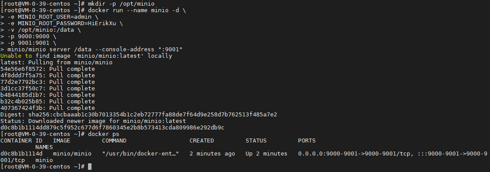
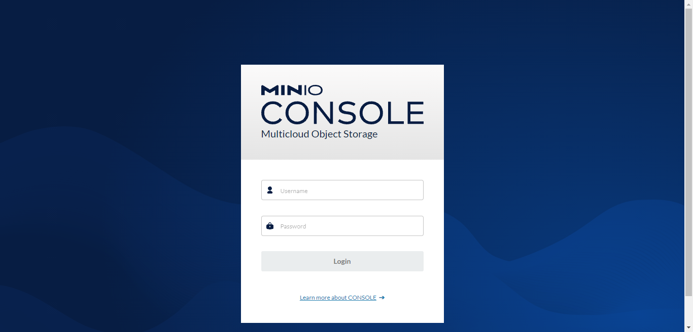
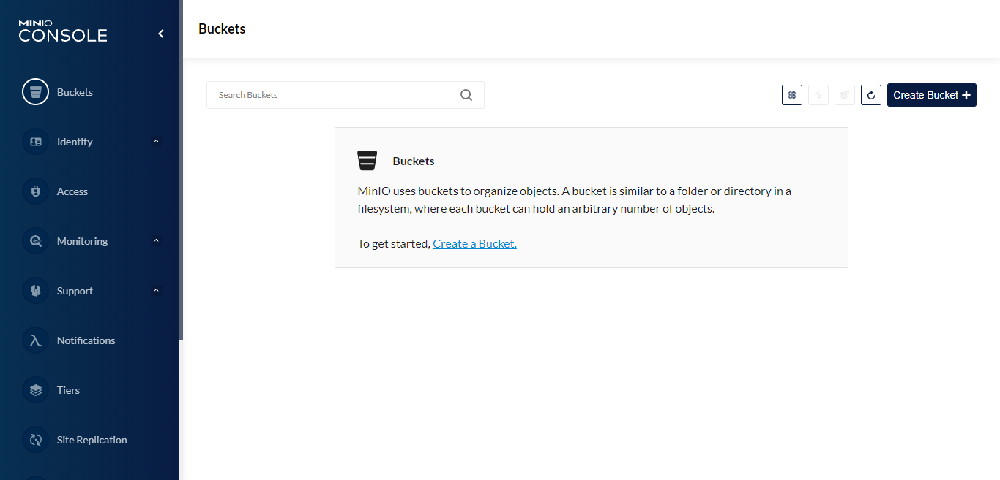

## 前言

MinIO 是目前比较常用的对象存储中间件，它一般用在私有部署场景，并且协议对标 AWS S3、Aliyun OSS 等对象存储服务，今天我们就来动手学一下用 docker 安装 MinIO。

## 安装

使用以下指令安装 MinIO：

``` bash
# 创建数据持久化目录
mkdir -p /opt/minio

# 启动 MinIO 容器
docker run --name minio -d \
-e MINIO_ROOT_USER=admin \
-e MINIO_ROOT_PASSWORD=HiErikXu \
-v /opt/minio:/data \
-p 9000:9000 \
-p 9001:9001 \
minio/minio server /data --console-address ":9001"

# 查看 MinIO 启动情况
docker ps
```



指令解析：

| 项目 | 说明 |
| ------- | ------- |
| docker run | 启动 docker 容器 |
| --name minio | 设置容器名称为 minio |
| -d | 后台运行 |
| -e MINIO_ROOT_USER=admin | 设置 root 账号的用户名为 admin，可以根据需要调整 |
| -e MINIO_ROOT_PASSWORD=HiErikXu | 设置 root 账号的密码为 HiErikXu，可以根据需要调整，长度最小为 8 |
| -v /opt/minio:/data | 把宿主机的 /opt/minio 目录映射到容器目录 /data |
| -p 9000:9000 | 把宿主机的 9000 端口映射到容器的 9000 端口，9000 是交互端口 |
| -p 9001:9001 | 把宿主机的 9001 端口映射到容器的 9001 端口，9001 是控制台端口 |
| minio/minio | 使用镜像，这里是 minio 的最新镜像，可以根据需要调整 |
| server /data --console-address ":9001" | 启动指令，设置数据目录为 /data，控制台端口为 9001 |

## 查看

MinIO 登录界面：



MinIO 控制台：



## 总结

按照上述的操作，今天应该能成功完成 Minio 安装的相关操作。

如有问题可以添加公众号【跬步之巅】进行交流。


