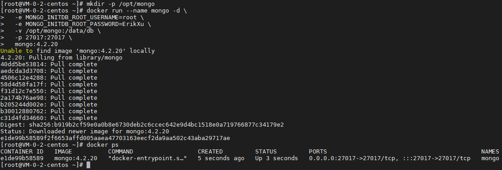
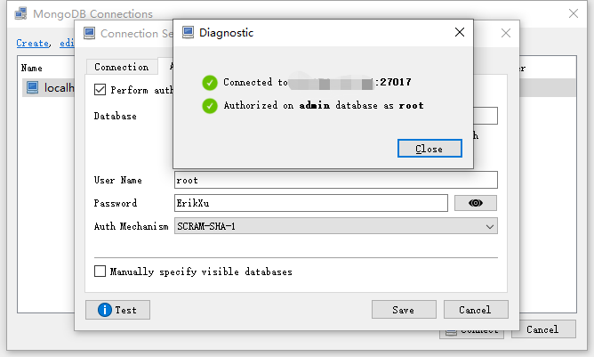
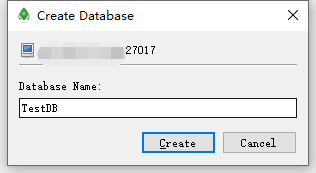
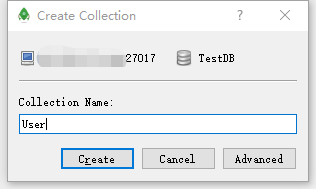
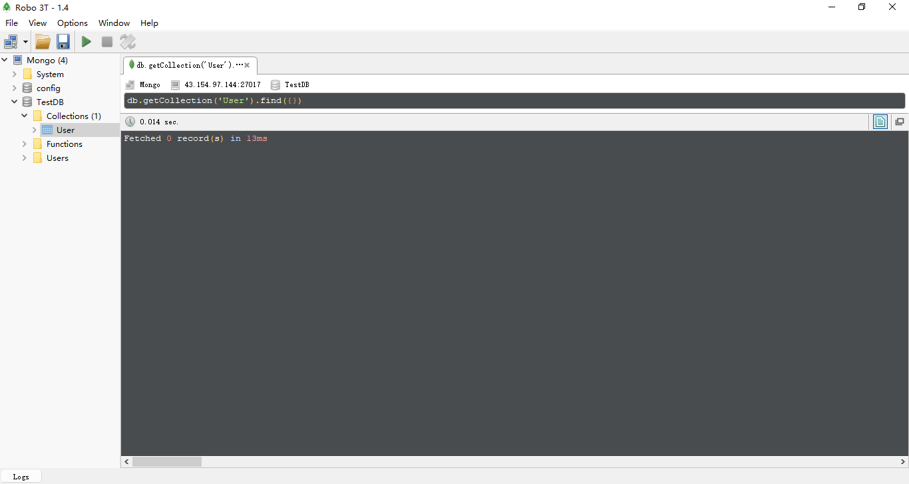

## 前言

MongoDB 是目前比较常用的 NoSQL 数据库，今天我们就来动手学一下用 docker 安装 MongoDB。

## 安装

使用以下指令安装 MongoDB：

``` bash
# 创建数据持久化目录
mkdir -p /opt/mongo

# 启动 MongoDB 容器
docker run --name mongo -d \
  -e MONGO_INITDB_ROOT_USERNAME=root \
  -e MONGO_INITDB_ROOT_PASSWORD=ErikXu \
  -v /opt/mongo:/data/db \
  -p 27017:27017 \
  mongo:4.2.20

# 查看 MongoDB 启动情况
docker ps
```



指令解析：

| 项目 | 说明 |
| ------- | ------- |
| docker run | 启动 docker 容器 |
| --name mongo | 设置容器名称为 mongo |
| -d | 后台运行 |
| -e MONGO_INITDB_ROOT_USERNAME=root | 设置 root 账号用户名为 root |
| -e MONGO_INITDB_ROOT_PASSWORD=ErikXu | 设置 root 账号的密码为 ErikXu |
| -v /opt/mongo:/data/db | 把宿主机的 /opt/mongo 目录映射到容器目录 /data/db |
| -p 27017:27017 | 把宿主机的 27017 端口映射到容器的 27017 端口 |
| mongo:4.2.20 | 使用镜像，这里是 MongoDB 4.2.20，可以根据需要调整 |

## 使用

### 登录

使用 Robot 3T 登录：



### 创建数据库



### 创建数据表



### 简单查询



## 总结

按照上述的操作，今天应该能成功完成安装 MongoDB 的相关操作。

如有问题可以添加公众号【跬步之巅】进行交流。


