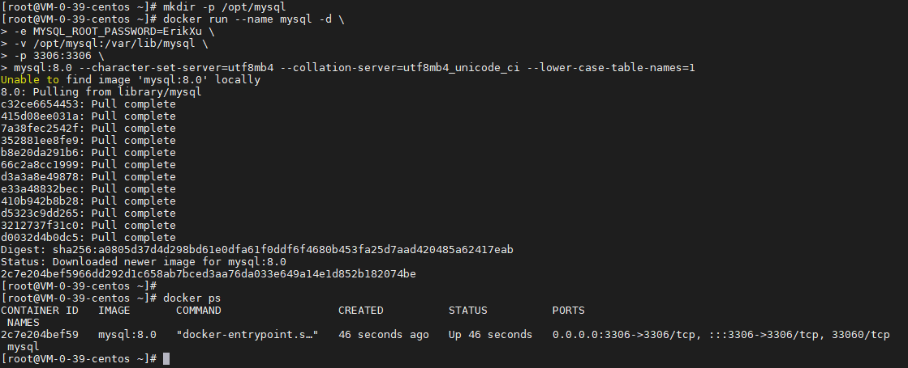
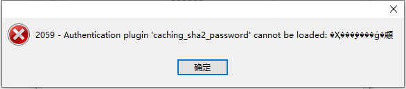
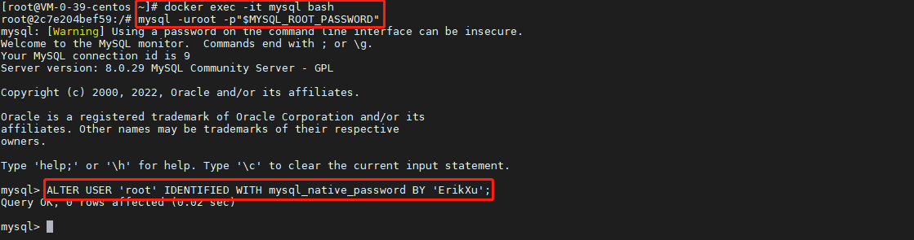
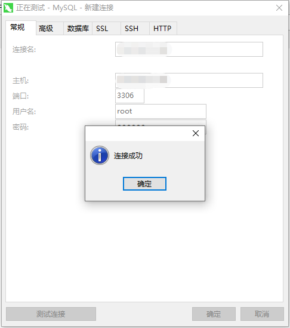

## 前言

MySQL 是目前比较常用的关系型数据库，今天我们就来动手学一下用 docker 安装 MySQL。

## 安装

使用以下指令安装 MySQL：

``` bash
# 创建数据持久化目录
mkdir -p /opt/mysql

# 启动 MySQL
docker run --name mysql -d \
-e MYSQL_ROOT_PASSWORD=ErikXu \
-v /opt/mysql:/var/lib/mysql \
-p 3306:3306 \
mysql:8.0 --character-set-server=utf8mb4 --collation-server=utf8mb4_unicode_ci --lower-case-table-names=1

# 查看 MySQL 启动情况
docker ps
```



指令解析：

| 项目 | 说明 |
| ------- | ------- |
| docker run | 启动 docker 容器 |
| --name mysql | 设置容器名称为 mysql |
| -d | 后台运行 |
| -e MYSQL_ROOT_PASSWORD=ErikXu | 设置 root 账号的密码为 ErikXu，可以根据需要调整 |
| -v /opt/mysql:/var/lib/mysql | 把宿主机的 /opt/mysql 目录映射到容器目录 /var/lib/mysql |
| -p 3306:3306 | 把宿主机的 3306 端口映射到容器的 3306 端口 |
| mysql:8.0 | 使用镜像，这里是 MySQL 8.0，可以根据需要调整 |
| --character-set-server=utf8mb4 | 设置数据库字符集为 utf8mb4 |
| --collation-server=utf8mb4_unicode_ci | 设置排序字符集为 utf8mb4_unicode_ci |
| --lower-case-table-names=1 | 设置表名存储在磁盘是小写的，但是比较的时候不区分大小写 |

## 修改密码认证方式

MySQL 8.0 版本开始更改了加密方式，而 Navicat 还是用原来的加密方式，此时会遇到 2059 - Authentication plugin 'caching_sha2_password' cannot be loaded 的问题：



为了能够解决登陆问题，需要修改密码认证方式：

``` bash
# 进入 MySQL 容器
docker exec -it mysql bash

# 使用 root 账号登录 MySQL，密码已存在环境变量 MYSQL_ROOT_PASSWORD 中
mysql -uroot -p"$MYSQL_ROOT_PASSWORD"

# 修改密码认证方式
ALTER USER 'root' IDENTIFIED WITH mysql_native_password BY 'ErikXu';
```



此时，就可以使用 Navicat 访问 MySQL 了：



## 总结

按照上述的操作，今天应该能成功完成 MySQL 安装的相关操作。

如有问题可以添加公众号【跬步之巅】进行交流。


