## 前言

今天将介绍 docker 网络，docker 网络是 docker 中一个重要的概念。容器间的访问，或者外部访问容器都会通过 docker 网络，今天我们就来动手学一下 docker 网络。

## 通过宿主机 IP 访问

### 获取宿主机 IP

使用以下指令获取宿主机 IP：

``` bash
ip a
```


从上图可知宿主机 IP 为：10.0.0.39

### 启动服务端

使用以下指令启动服务端：

``` bash
# 启动服务端
docker run --name http-server -d -p 80:80 nginx:latest

# 查看启动情况
docker ps
```

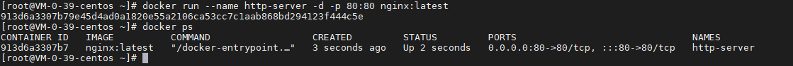

### 启动客户端

使用以下指令启动客户端：

``` bash
# 启动客户端
docker run --name http-client -d nginx:latest

# 查看启动情况
docker ps
```

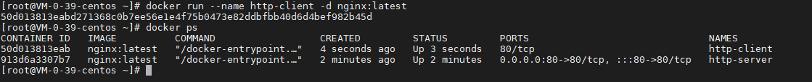

### 访问服务端

使用以下指令访问服务端：

``` bash
# 进入容器
docker exec -it http-client bash

# 通过宿主机 IP 访问服务端
curl http://10.0.0.39
```


### 清理工作

使用以下指令进行清理：

``` bash
# 退出容器
exit

# 清理服务端
docker rm -f http-server

# 清理客户端
docker rm -f http-client

# 查看清理情况
docker ps
```

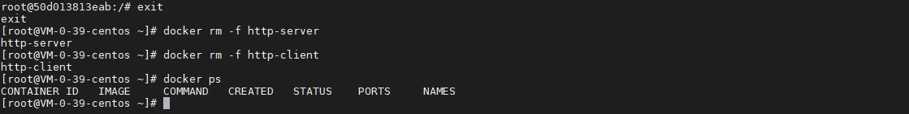

## 通过 Link 访问

### 启动服务端

使用以下指令启动服务端：

``` bash
# 启动服务端
docker run --name http-server -d nginx:latest

# 查看启动情况
docker ps
```

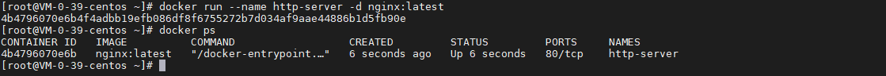

### 启动客户端

使用以下指令启动客户端：

``` bash
# 启动客户端
docker run --name http-client --link http-server:http-server -d nginx:latest

# 查看启动情况
docker ps
```

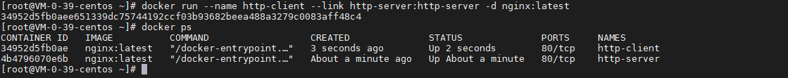

### 访问服务端

使用以下指令访问服务端：

``` bash
# 进入容器
docker exec -it http-client bash

# 通过宿主机 IP 访问服务端
curl http://http-server
```

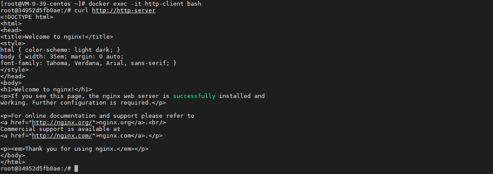

### 清理工作

使用以下指令进行清理：

``` bash
# 退出容器
exit

# 清理服务端
docker rm -f http-server

# 清理客户端
docker rm -f http-client

# 查看清理情况
docker ps
```

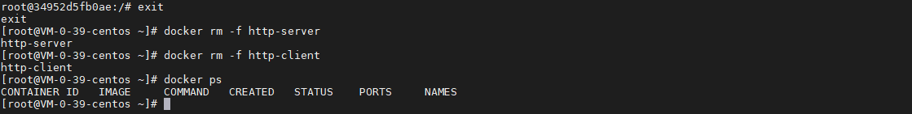

## HostNetwork 模式

### 启动服务端

使用以下指令启动服务端：

``` bash
# 启动服务端
docker run --name http-server --net=host -d nginx:latest

# 查看启动情况
docker ps
```

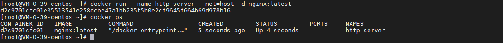

### 启动客户端

使用以下指令启动客户端：

``` bash
# 启动客户端
docker run --name http-client -d nginx:latest

# 查看启动情况
docker ps
```

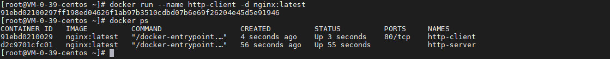

### 访问服务端

使用以下指令访问服务端：

``` bash
# 进入容器
docker exec -it http-client bash

# 通过宿主机 IP 访问服务端
curl http://10.0.0.39
```

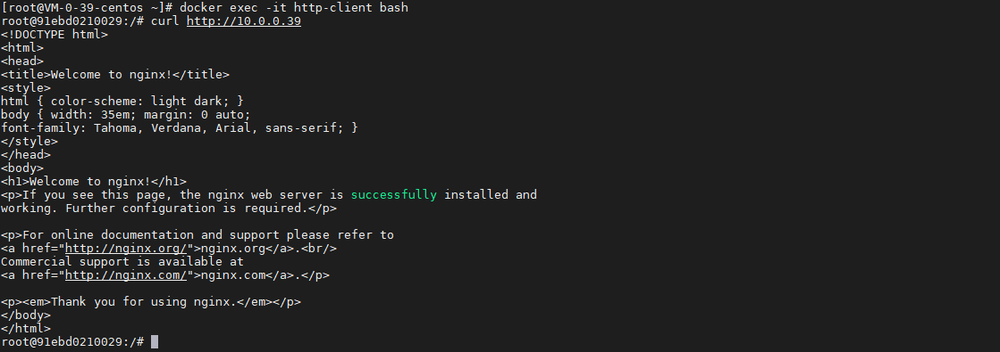

### 清理工作

使用以下指令进行清理：

``` bash
# 退出容器
exit

# 清理服务端
docker rm -f http-server

# 清理客户端
docker rm -f http-client

# 查看清理情况
docker ps
```

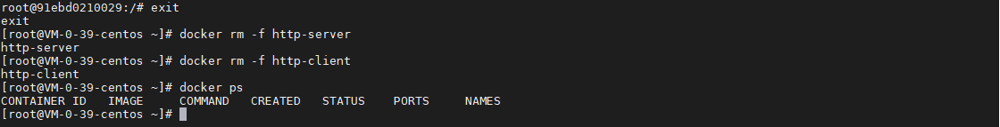

## 总结

按照上述的操作，今天应该能成功完成 docker 网络的相关操作。

如有问题可以添加公众号【跬步之巅】进行交流。


