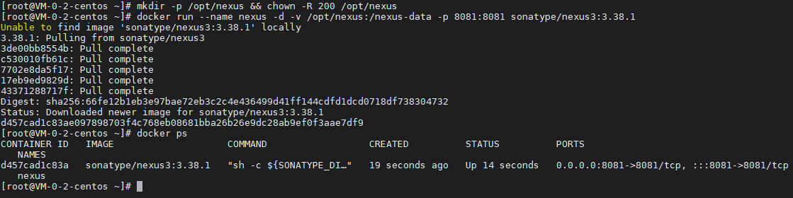
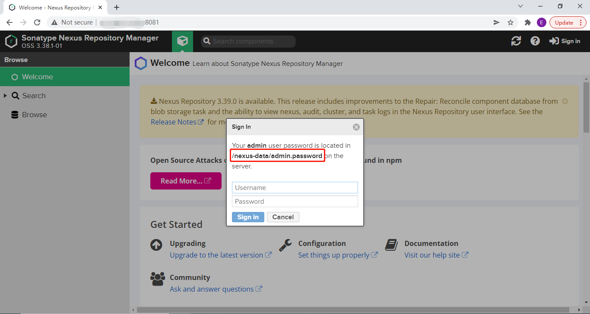
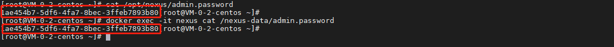
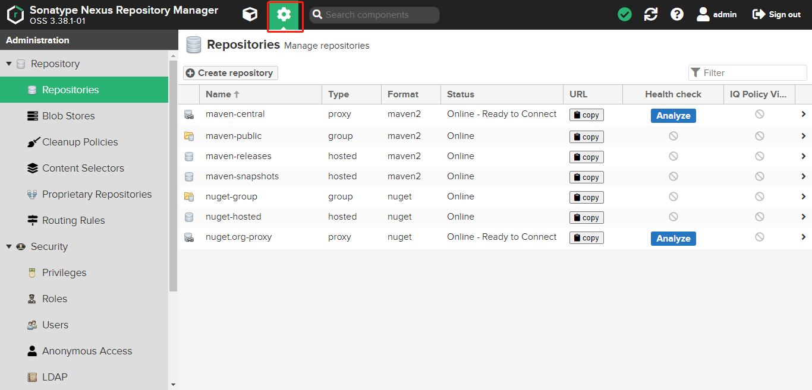
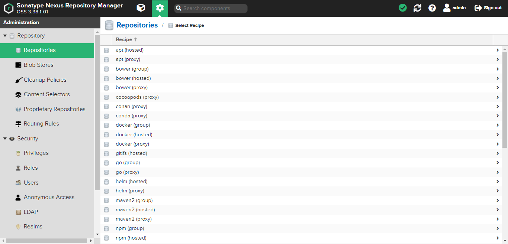
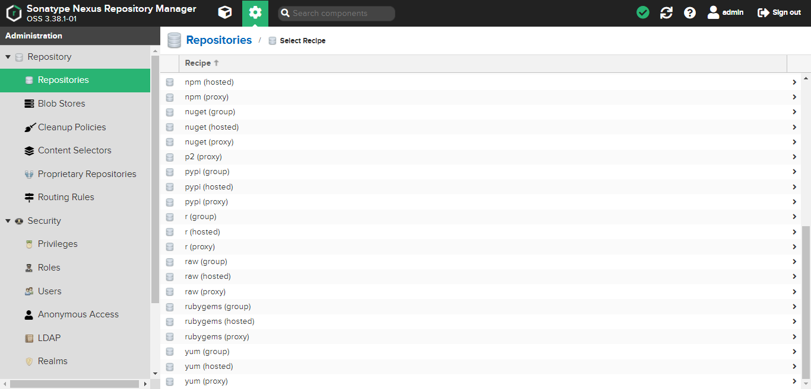

## 前言

Nexus 是目前比较常用的私有仓库中间件，支持 apt、yum、maven、npm、pypi、nuget 等私有仓库，今天我们就来动手学一下用 docker 安装 Nexus。

## 安装

使用以下指令安装 Nexus：

``` bash
# 创建数据持久化目录
mkdir -p /opt/nexus && chown -R 200 /opt/nexus

# 启动 Nexus 容器
docker run --name nexus -d -v /opt/nexus:/nexus-data -p 8081:8081 sonatype/nexus3:3.38.1

# 查看 Nexus 启动情况
docker ps
```



指令解析：

| 项目 | 说明 |
| ------- | ------- |
| docker run | 启动 docker 容器 |
| --name nexus | 设置容器名称为 nexus |
| -d | 后台运行 |
| -h redis | 设置 host 为 redis |
| -v /opt/nexus:/nexus-data | 把宿主机的 /opt/nexus 目录映射到容器目录 /nexus-data |
| -p 8081:8081 | 把宿主机的 6379 端口映射到容器的 6379 端口 |
| sonatype/nexus3:3.38.1 | 使用镜像，这里是 nexus 3.38.1，可以根据需要调整 |

## 使用

### 浏览器访问



### 获取登录密码

提示需要在容器 /nexus-data/admin.password 文件中获取 admin 的密码，我们可以通过以下指令获取：

``` bash
# 由于容器目录 /nexus-data 映射到了 /opt/nexus，我们可以直接访问宿主机文件
cat /opt/nexus/admin.password

# 也可以通过 docker exec 获取
docker exec -it nexus cat /nexus-data/admin.password
```



### 使用介绍

进入 Repositories 界面：



可以看到 Nexus 已经默认建好了 Maven 和 Nuget 的私有仓库，以下为仓库简单介绍：

| 仓库 | 描述 |
| ------- | ------- |
| maven-central | 只读，代理官方 maven 仓库，并把下过的包保存到 maven-central |
| maven-snapshots | 一般只写，用来保存自己开发的 snapshot 包，与第三方（官方）包独立 |
| maven-releases | 一般只写，用来保存自己开发的 release 包，与第三方（官方）包独立 |
| maven-public | 只读，上述三个 maven 库的组合，即可拉取自己开发的包，也可以拉取第三方（官方）包 |
| nuget.org-proxy | 只读，代理官方 nuget.org 仓库，并把下过的包保存到 nuget.org-proxy |
| nuget-hosted | 一般只写，用来保存自己开发的包，与第三方（官方）包独立 |
| nuget-group | 只读，上述两个个 nuget 库的组合，即可拉取自己开发的包，也可以拉取第三方（官方）包 |

其它支持的仓库如下：





## 总结

按照上述的操作，今天应该能成功完成 Nexus 安装的相关操作。

如有问题可以添加公众号【跬步之巅】进行交流。


