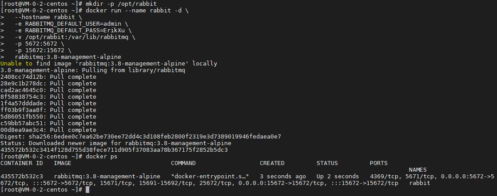

## 前言

RabbitMQ 是目前比较常用的消息中间件，今天我们就来动手学一下用 docker 安装 RabbitMQ。

## 安装

使用以下指令安装 RabbitMQ：

``` bash
# 创建数据持久化目录
mkdir -p /opt/rabbit

# 启动 RabbitMQ 容器
docker run --name rabbit -d \
  --hostname rabbit \
  -e RABBITMQ_DEFAULT_USER=admin \
  -e RABBITMQ_DEFAULT_PASS=ErikXu \
  -v /opt/rabbit:/var/lib/rabbitmq \
  -p 5672:5672 \
  -p 15672:15672 \
  rabbitmq:3.8-management-alpine

# 查看 RabbitMQ 启动情况
docker ps
```



指令解析：

| 项目 | 说明 |
| ------- | ------- |
| docker run | 启动 docker 容器 |
| --name rabbit | 设置容器名称为 rabbit |
| -d | 后台运行 |
| --hostname rabbit | 设置 host 为 rabbit |
| -e RABBITMQ_DEFAULT_USER=admin | 设置默认用户为 admin |
| -e RABBITMQ_DEFAULT_PASS=ErikXu | 设置默认用户的密码为 ErikXu |
| -v /opt/rabbit:/var/lib/rabbitmq | 把宿主机的 /opt/rabbit 目录映射到容器目录 /var/lib/rabbitmq |
| -p 5672:5672 | 把宿主机的 5672 端口映射到容器的 5672 端口，5672 为 RabbitMQ 的通讯端口 |
| -p 15672:15672 | 把宿主机的 15672 端口映射到容器的 15672 端口，15672 为 RabbitMQ 的管理控制台端口 |
| rabbitmq:3.8-management-alpine | 使用镜像，这里是 RabbitMQ 3.8，带管理控制台，alpine 操作系统（体积较小），可以根据需要调整 |

## 使用

### 登录管理控制台


### 访问管理控制台


## 总结

按照上述的操作，今天应该能成功完成安装 RabbitMQ 的相关操作。

如有问题可以添加公众号【跬步之巅】进行交流。


