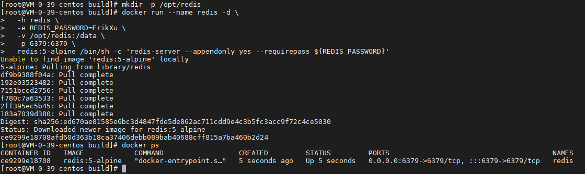
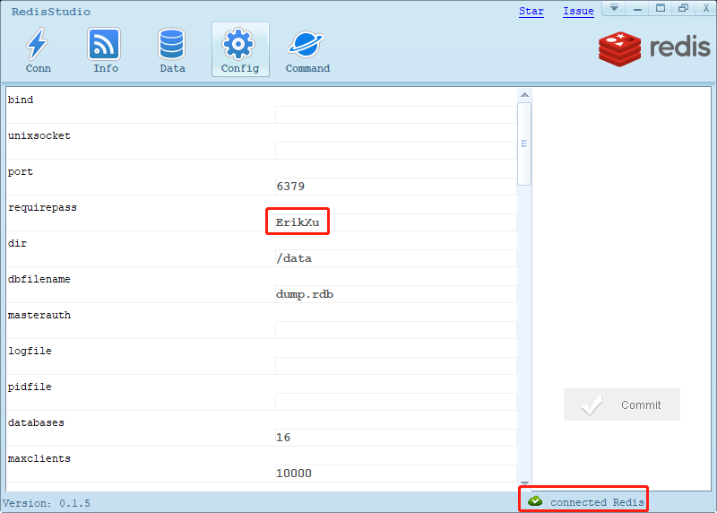

## 前言

Redis 是目前比较常用的缓存中间件，今天我们就来动手学一下用 docker 安装 Redis。

## 安装

使用以下指令安装 Redis：

``` bash
# 创建数据持久化目录
mkdir -p /opt/redis

# 启动 redis
docker run --name redis -d \
  -h redis \
  -e REDIS_PASSWORD=ErikXu \
  -v /opt/redis:/data \
  -p 6379:6379 \
  redis:5-alpine /bin/sh -c 'redis-server --appendonly yes --requirepass ${REDIS_PASSWORD}'

# 查看 Redis 启动情况
docker ps
```



指令解析：

| 项目 | 说明 |
| ------- | ------- |
| docker run | 启动 docker 容器 |
| --name redis | 设置容器名称为 redis |
| -d | 后台运行 |
| -h redis | 设置 host 为 redis |
| -e REDIS_PASSWORD=ErikXu | 设置 redis 的密码为 ErikXu，可以根据需要调整 |
| -v /opt/redis:/data | 把宿主机的 /opt/redis 目录映射到容器目录 /data |
| -p 6379:6379 | 把宿主机的 6379 端口映射到容器的 6379 端口 |
| redis:5-alpine | 使用镜像，这里是 redis 5，alpine 操作系统（体积较小），可以根据需要调整 |
| /bin/sh -c redis-server --appendonly yes --requirepass ${REDIS_PASSWORD} | 启动指令，使用环境变量 REDIS_PASSWORD 的值作为 redis 的密码 |

## 使用

使用客户端工具连接 Redis：



## 总结

按照上述的操作，今天应该能成功完成 Redis 安装的相关操作。

如有问题可以添加公众号【跬步之巅】进行交流。


