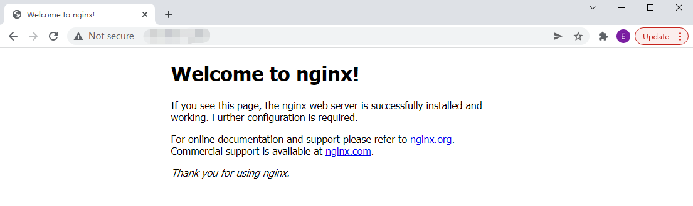

## 前言

安装完 docker 后，今天我们就来动手启动第一个 docker 程序 nginx。

## 启动 Nginx

使用以下指令启动 nginx：

``` bash
docker run --name nginx -d -p 80:80 nginx:latest
```


指令解析：

| 项目 | 说明 |
| ------- | ------- |
| docker run | 启动 docker 容器 |
| \-\-name nginx | 设置容器名称为 nginx |
| \-d | 后台运行 |
| \-p 80:80 | 把宿主机的 80 端口映射到容器的 80 端口，格式为 \-p {宿主机端口}:{容器端口} |
| nginx:latest | 使用镜像，这里是 nginx 最新版本的镜像，格式为 {镜像名称}:{镜像版本} |

## 查看镜像

使用以下指令查看镜像：

``` bash
docker images
```


## 查看运行中的容器

使用以下指令查看运行中的容器：

``` bash
docker ps
```


## 访问 Nginx

- 浏览器访问



- 指令访问

``` bash
curl http://localhost
```


## 暂停 Nginx

使用以下指令暂停 nginx：

``` bash
# 暂停 nginx
docker stop nginx

# 查看暂停效果
docker ps -a
```


## 删除 Nginx

使用以下指令删除 nginx：

``` bash
# 删除 nginx
docker rm nginx

# 查看删除效果
docker ps -a
```


## 总结

按照上述的操作，今天应该可以成功运行第一个 docker 程序。

如有问题可以添加公众号【跬步之巅】进行交流。


