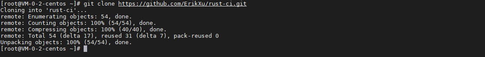
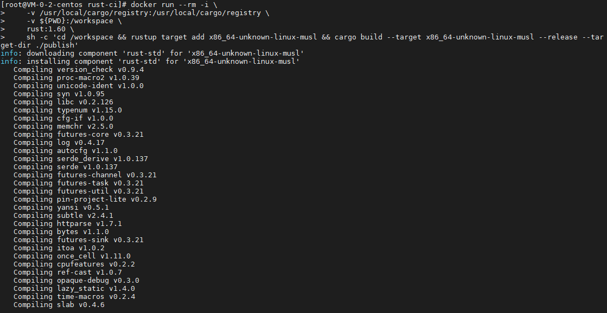
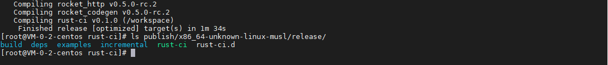
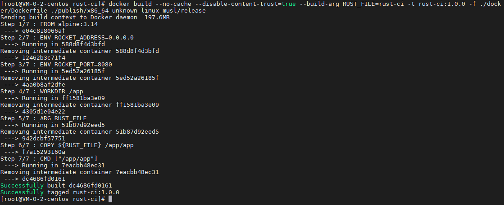
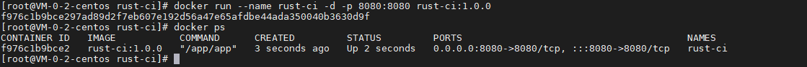
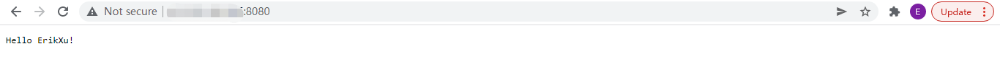

## 前言

从之前的文章《[构建 Docker 镜像](build.md)》，我们简单构建了第一个自己的 docker 镜像，今天我们就来动手学一下构建 Rust 开发程序的 docker 镜像。

## 准备工作

为了方便操作，我用 rocket 写好了一个 hello world 的程序，仓库地址是：

[https://github.com/ErikXu/rust-ci](https://github.com/ErikXu/rust-ci)

安装 git 并克隆代码：

``` bash
yum install git -y

git clone https://github.com/ErikXu/rust-ci.git
```



## 镜像构建

进入代码目录：

``` bash
cd rust-ci
```

### 编译可执行文件

使用以下指令编译可执行文件：

``` bash
# 编译可执行文件
docker run --rm -i \
    -v /usr/local/cargo/registry:/usr/local/cargo/registry \
    -v ${PWD}:/workspace \
    rust:1.60 \
    sh -c 'cd /workspace && rustup target add x86_64-unknown-linux-musl && cargo build --target x86_64-unknown-linux-musl --release --target-dir ./publish'

# 查看可执行文件
ls publish/x86_64-unknown-linux-musl/release/
```





指令解析：

| 项目 | 说明 |
| ------- | ------- |
| docker run | 启动 docker 容器 |
| --rm | 退出容器时销毁容器 |
| -i | 容器交互模式 |
| -v /usr/local/cargo/registry:/usr/local/cargo/registry | 把宿主机的 /usr/local/cargo/registry 目录映射到容器目录 /usr/local/cargo/registry，重用已下载过的包 |
| -v ${PWD}:/workspace | 把宿主机当前目录映射到容器目录 /workspace |
| rust:1.60 | 使用 rust 1.60 镜像 |
| sh -c cd /workspace && ... | 启动指令，进入 /workspace 目录执行 rustup target add 添加目标平台，执行 cargo build 编译可执行文件 |

### 构建镜像

使用以下指令把可执行文件打入镜像：

``` bash
docker build --no-cache --disable-content-trust=true --build-arg RUST_FILE=rust-ci -t rust-ci:1.0.0 -f ./docker/Dockerfile ./publish/x86_64-unknown-linux-musl/release
```



指令解析：

| 项目 | 说明 |
| ------- | ------- |
| docker build | 构建 docker 容器 |
| -t rust-ci:1.0.0 | 设置镜像名称为 rust-ci:1.0.0 |
| --no-cache | 不使用镜像缓存 |
| --disable-content-trust=true | 禁用内容信任 |
| --build-arg RUST_FILE=rust-ci | 设置构建参数 RUST_FILE 的值为 rust-ci |
| -f ./docker/Dockerfile | 设置 Dockerfile 的路径为 ./docker/Dockerfile |
| ./publish/x86_64-unknown-linux-musl/release | 指定构建目录为 ./publish/x86_64-unknown-linux-musl/release |

其中 Dockerfile 内容如下：

``` dockerfile
# 使用 alpine 作为基础镜像
FROM alpine:3.14

# 通过环境变量指定监听地址
ENV ROCKET_ADDRESS=0.0.0.0

# 通过环境变量指定监听端口
ENV ROCKET_PORT=8080

# 设置 /app 为工作目录
WORKDIR /app

# 定义构建参数 JAR_FILE，表示宿主机 rust 可执行文件路径
ARG RUST_FILE

# 把 rust 可执行文件拷贝到镜像的 /app/app
COPY ${RUST_FILE} /app/app

# 启动指令
CMD ["/app/app"]
```

## 镜像运行

使用以下指令运行镜像：

``` bash
# 运行镜像
docker run --name rust-ci -d -p 8080:8080 rust-ci:1.0.0

# 查看运行情况
docker ps
```



运行效果：



## 总结

按照上述的操作，今天应该能成功完成 Rust 镜像构建的相关操作。

如有问题可以添加公众号【跬步之巅】进行交流。


