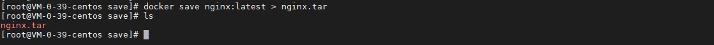
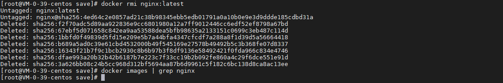
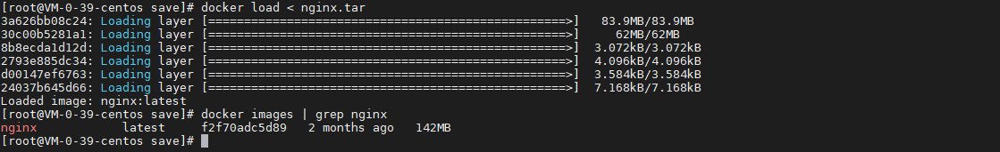

## 前言

当还没有搭建镜像仓库或者没有 docker hub 账号的时候，可以把镜像导出到本地，然后把本地文件拷贝到目标机器进行导出，今天我们就来动手学一下 docker 镜像导入导出。

## 导出镜像

使用以下指令把 nginx 镜像导出到本地：

``` bash
# 导出镜像
docker save nginx:latest > nginx.tar

# 查看导出文件
ls 
```



## 删除镜像

使用以下指令删除 nginx 镜像：

``` bash
# 删除镜像
docker rmi nginx:latest

# 查看删除情况
docker images | grep nginx
```



## 导入镜像

使用以下指令从本地文件导入镜像：

``` bash
# 导入镜像
docker load < nginx.tar

# 查看导入情况
docker images | grep nginx
```



## 总结

按照上述的操作，今天应该能成功完成镜像导入导出的相关操作。

如有问题可以添加公众号【跬步之巅】进行交流。


