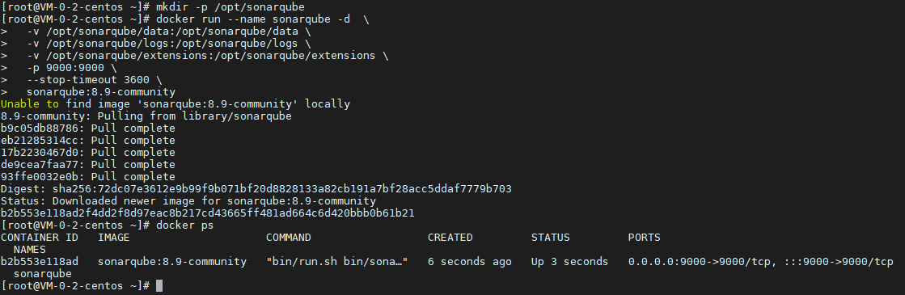
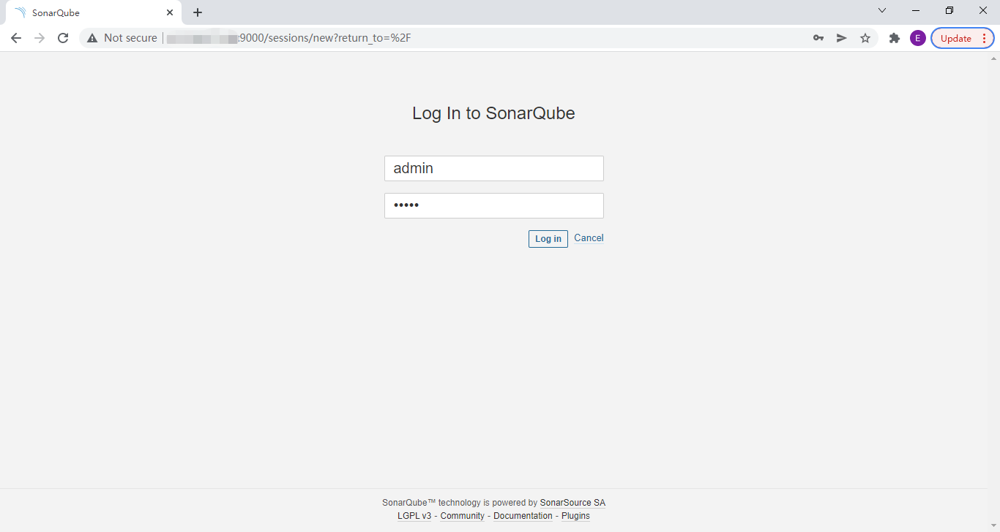
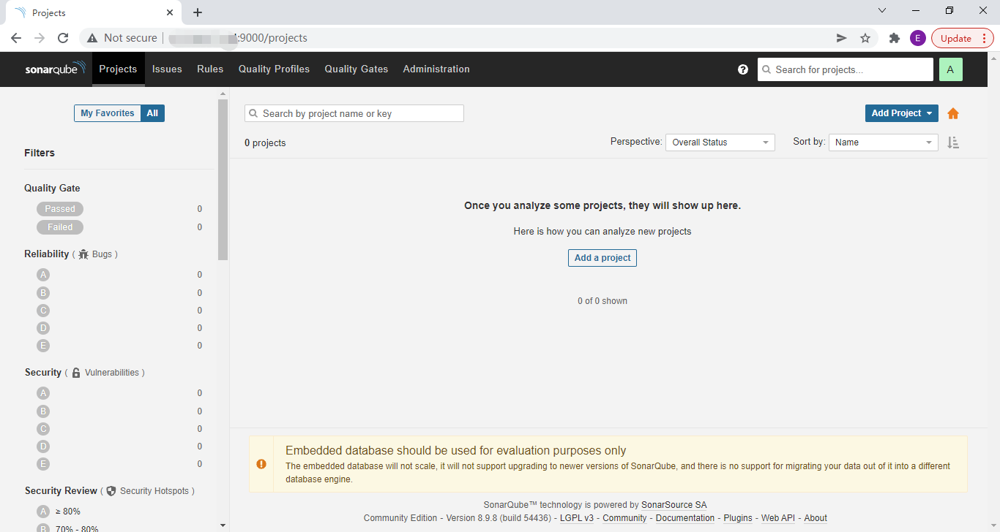

## 前言

SonarQube 是目前比较常用的代码静态扫描工具，今天我们就来动手学一下用 docker 安装 SonarQube。

## 安装

使用以下指令安装 SonarQube：

``` bash
# 创建数据持久化目录
mkdir -p /opt/sonarqube

# 启动 SonarQube 容器
docker run --name sonarqube -d  \
  -v /opt/sonarqube/data:/opt/sonarqube/data \
  -v /opt/sonarqube/logs:/opt/sonarqube/logs \
  -v /opt/sonarqube/extensions:/opt/sonarqube/extensions \
  -p 9000:9000 \
  --stop-timeout 3600 \
  sonarqube:8.9-community

# 查看 SonarQube 启动情况
docker ps  
```



指令解析：

| 项目 | 说明 |
| ------- | ------- |
| docker run | 启动 docker 容器 |
| --name sonarqube | 设置容器名称为 sonarqube |
| -d | 后台运行 |
| -v /data/sonarqube/data:/opt/sonarqube/data | 把宿主机的 /data/sonarqube/data 目录映射到容器目录 /data/sonarqube/data，其中 data 为数据目录 |
| -v /data/sonarqube/data:/opt/sonarqube/logs | 把宿主机的 /data/sonarqube/logs 目录映射到容器目录 /data/sonarqube/logs，其中 logs 为日志目录 |
| -v /data/sonarqube/data:/opt/sonarqube/extensions | 把宿主机的 /data/sonarqube/extensions 目录映射到容器目录 /data/sonarqube/extensions，其中 extensions 为扩展插件目录 |
| -p 9000:9000 | 把宿主机的 9000 端口映射到容器的 9000 端口 |
| --stop-timeout 3600 | 设置 sonarqube 的停止时间为 3600 秒，保证 sonarqube 停止时，正在运行的任务能够正常完成 |
| sonarqube:8.9-community | 使用镜像，这里是 SonarQube 8.9 社区版，可以根据需要调整 |

## 使用

### 登录

使用浏览器访问，并使用默认账号密码 admin / admin 进行登录：



### 修改密码

第一次登录时，需要修改密码：


### 访问控制台界面



## 总结

按照上述的操作，今天应该能成功完成安装 SonarQube 的相关操作。

如有问题可以添加公众号【跬步之巅】进行交流。


