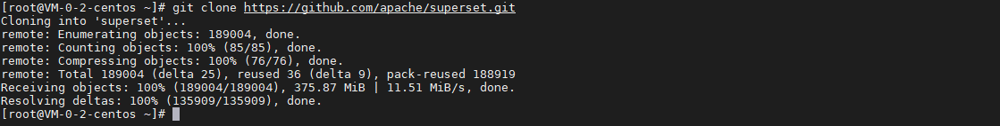
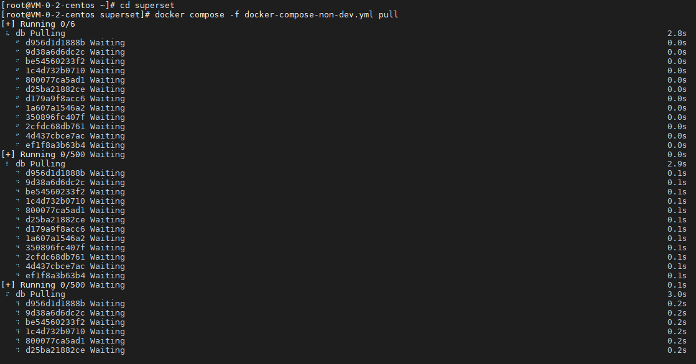
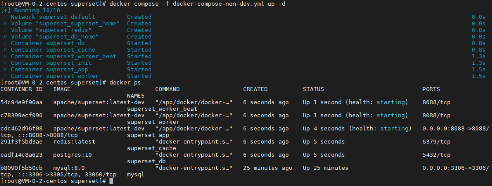
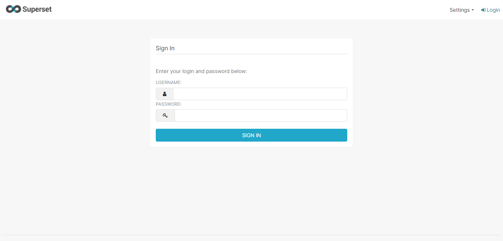
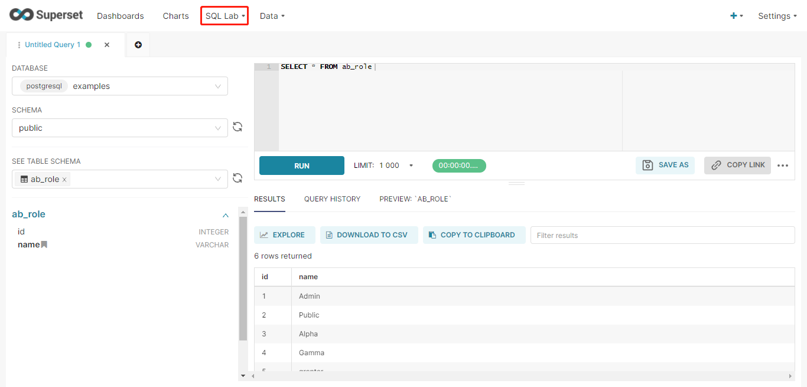

## 前言

Superset 是一个强大的在线 SQL 查询编辑工具，同时也是一个轻量级的 BI 工具，今天我们就来动手学一下用 docker compose 安装 Superset。

## 安装

安装 git 并克隆项目：

``` bash
yum install git -y

git clone https://github.com/apache/superset.git
```



安装 superset：

``` bash
# 进入项目目录
cd superset

# 拉取相关镜像
docker compose -f docker-compose-non-dev.yml pull

# 启动 superset
docker compose -f docker-compose-non-dev.yml up -d

# 查看启动情况
docker ps
```





## 简单使用

### 登录

默认账号密码为 admin / admin：



### 执行 SQL

在 SQL Editor 中执行 SQL：



## 总结

按照上述的操作，今天应该能成功完成 Superset 安装的相关操作。

如有问题可以添加公众号【跬步之巅】进行交流。


