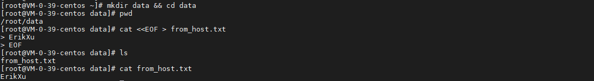
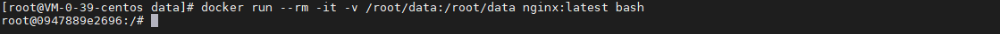
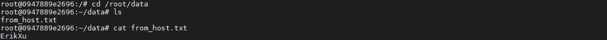
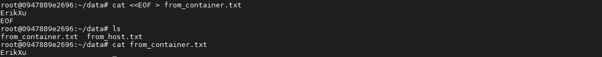
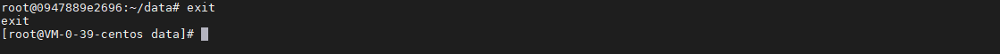
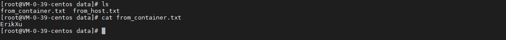

## 前言

docker 容器可以理解为无状态的应用，随着容器的销毁，容器内的内容也会跟着销毁，而容器挂载正是解决这一问题的方法。通过容器挂载可以使容器指定内容实现持久化。

## 准备

在宿主机创建目录及文件，用于挂载：

``` bash
# 创建并进入目录
mkdir data && cd data

# 查看目录路径
pwd

# 新建文件并写入内容
cat <<EOF > from_host.txt
ErikXu
EOF

# 查看新建的文件及内容
ls
cat from_host.txt
```



## 启动容器

使用以下指令启动容器并挂载：

``` bash
docker run --rm -it -v /root/data:/root/data nginx:latest bash
```



指令解析：

| 项目 | 说明 |
| ------- | ------- |
| docker run | 启动 docker 容器 |
| \-\-rm | 退出容器时销毁容器 |
| \-it | 容器交互模式 |
| \-v /root/data:/root/data | 把宿主机目录挂载到容器，格式：\-v {宿主机路径}:{容器路径} |
| nginx:latest | 使用 nginx 的最新镜像 |
| bash | 使用 bash 作为镜像启动指令 |

查看挂载内容：

``` bash
cd /root/data
ls
cat from_host.txt
```



在容器中新建文件并写入内容：

``` bash
# 新建文件并写入内容
cat <<EOF > from_container.txt
ErikXu
EOF

# 查看新建的文件及内容
ls
cat from_container.txt
```



## 销毁容器

使用以下指令退出并销毁容器：

``` bash
exit
```



从宿主机查看容器中创建的文件及内容：

``` bash
ls
cat from_container.txt
```



## 总结

按照上述的操作，今天应该能成功完成容器挂载的相关操作。

如有问题可以添加公众号【跬步之巅】进行交流。


