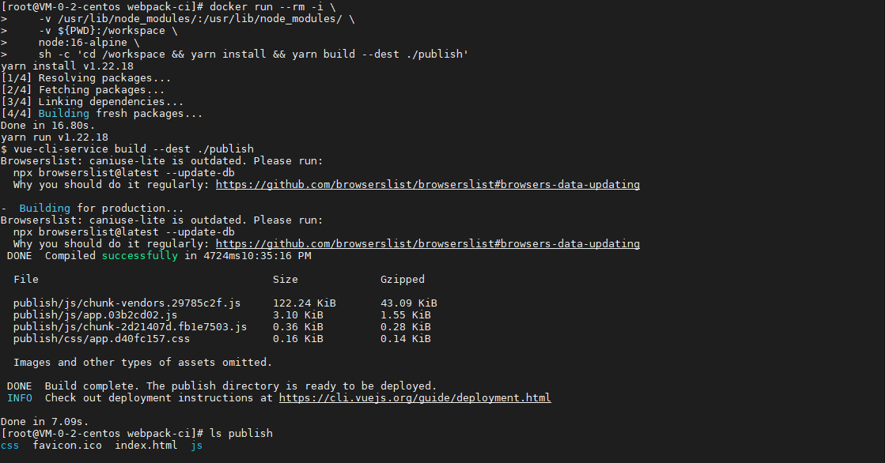
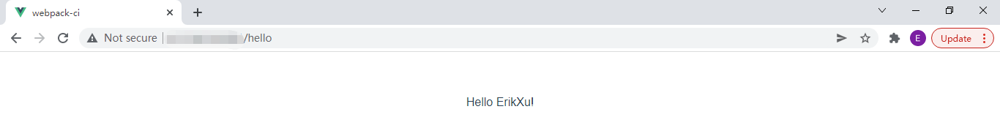

## 前言

从之前的文章《[构建 Docker 镜像](build.md)》，我们简单构建了第一个自己的 docker 镜像，今天我们就来动手学一下构建 Webpack 开发程序的 docker 镜像。

## 准备工作

为了方便操作，我用 vue.js 写好了一个 hello world 的程序，仓库地址是：

[https://github.com/ErikXu/webpack-ci](https://github.com/ErikXu/webpack-ci)

安装 git 并克隆代码：

``` bash
yum install git -y

git clone https://github.com/ErikXu/webpack-ci.git
```


## 镜像构建

进入代码目录：

``` bash
cd webpack-ci
```

### 编译静态文件

使用以下指令编译静态文件：

``` bash
# 编译静态文件
docker run --rm -i \
    -v /usr/lib/node_modules/:/usr/lib/node_modules/ \
    -v ${PWD}:/workspace \
    node:16-alpine \
    sh -c 'cd /workspace && yarn install && yarn build --dest ./publish'

# 查看静态文件
ls publish
```



指令解析：

| 项目 | 说明 |
| ------- | ------- |
| docker run | 启动 docker 容器 |
| --rm | 退出容器时销毁容器 |
| -i | 容器交互模式 |
| -v /usr/lib/node_modules/:/usr/lib/node_modules/ | 把宿主机的 /usr/lib/node_modules/ 目录映射到容器目录 /usr/lib/node_modules/，重用已下载过的包 |
| -v ${PWD}:/workspace | 把宿主机当前目录映射到容器目录 /workspace |
| node:16-alpine | 使用 node 16 镜像，Alpine 操作系统 |
| sh -c cd /workspace && ... | 启动指令，进入 /workspace 目录执行 yarn build 编译静态文件 |

### 构建镜像

使用以下指令把静态文件打入镜像：

``` bash
docker build --no-cache --disable-content-trust=true -t webpack-ci:1.0.0 -f ./docker/Dockerfile ./publish/
```


指令解析：

| 项目 | 说明 |
| ------- | ------- |
| docker build | 构建 docker 容器 |
| -t webpack-ci:1.0.0 | 设置镜像名称为 webpack-ci:1.0.0 |
| --no-cache | 不使用镜像缓存 |
| --disable-content-trust=true | 禁用内容信任 |
| -f ./docker/Dockerfile | 设置 Dockerfile 的路径为 ./docker/Dockerfile |
| ./publish/ | 指定构建目录为 ./publish/ |

其中 Dockerfile 内容如下：

``` dockerfile
# 使用 nginx 作为基础镜像
FROM nginx:1.20-alpine

# 拷贝静态文件到 /usr/share/nginx/html 目录
COPY . /usr/share/nginx/html

# 支持 history 路由模式，如果使用 hash 路由可注释掉这一行
RUN sed -i 's|\s\+root\s\+/usr/share/nginx/html|        try_files $uri $uri/ /index.html;\n        root   /usr/share/nginx/html|' /etc/nginx/conf.d/default.conf

# 暴露 80 端口
EXPOSE 80

# 启动指令
ENTRYPOINT ["/docker-entrypoint.sh"]
CMD ["nginx", "-g", "daemon off;"]
```

## 镜像运行

使用以下指令运行镜像：

``` bash
# 运行镜像
docker run --name webpack-ci -d -p 80:80 webpack-ci:1.0.0

# 查看运行情况
docker ps
```


运行效果：



## 总结

按照上述的操作，今天应该能成功完成 Webpack 镜像构建的相关操作。

如有问题可以添加公众号【跬步之巅】进行交流。


